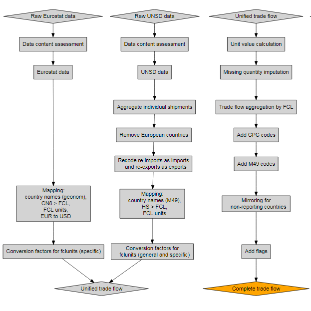

# Complete tf cpc

## Data

Raw data are provided by the SWS Team (subunit of Team F) for both
UNSD Tariff line and Eurostat Data. The data is prefiltered by
downloading only chapters of interest, which are:

  01, 02, 03, 04, 05, 06, 07, 08, 09, 10, 11, 12, 13, 14, 15, 16, 17, 18,
  19, 20, 21, 22, 23, 24, 33, 35, 38, 40, 41, 43, 50, 51, 52, 53.

In the future, if other commodities become of interest for
the division, it is important to include additional chapters in
the first step of the downloading.

  ##  reporter partner       hs flow year     value weight qty qunit    hs6
  ##        90     458     3303    1 2009  54.75252     NA  NA     1   3303
  ##       184      36 07121000    1 2009 634.93650     NA  NA     1 071210
  ##       184      36 09011200    1 2009 470.57794     NA  NA     1 090112
  ##       184     554 12100000    1 2009 544.94550     NA  NA     1 121000
  ##       184     504 21050020    1 2009 379.96200     NA  NA     1 210500
  ##        90      36     5203    1 2009  36.37752     NA  NA     1   5203

Besides filtering by chapters, only some HS codes inside the
chapters are considered. These codes are given in the
`hs6faointerest` datatable:

  ##  hs6_code
  ##    010100
  ##    010101
  ##    010102
  ##    010103
  ##    010104
  ##       ...       
  ##    530596
  ##    530597
  ##    530598
  ##    530599
  ##    530810

Both Eurostat and Tariff line data are given the same variable
names and data types before being processed further.

### Eurostat

- only numeric codes of reporters and partners are kept (letters
  are not allowed; basically this removes the "EU" total).

- only numeric CN8 codes (`hs`) are kept (letters are not
  allowed).

- only `stat_regime` equal to 4 is kept.

  > In this system ["Statistical regime 4" or "Total trade"], the
  > recorded aggregates include all goods entering or leaving the
  > economic territory of a country with the exception of simple
  > transit trade. In particular, all goods received into customs
  > warehouses are recorded as imports, regardless of whether they
  > subsequently go into free circulation in the Member State of
  > receipt. Similarly, outgoing goods from customs warehouses are
  > included in the general trade aggregates, at the time they
  > leave the Member State.

  See pag. 9 in *DG Trade Statistical Guide*, June 2016,
  http://trade.ec.europa.eu/doclib/docs/2013/may/tradoc_151348.pdf

### UNSD

- only numeric HS (`hs`) codes are kept (letters are not
  allowed).

## Process

### Aggregate UNSD Tariff line individual Shipments

The tariffline data from UNSD contains multiple rows with
identical combination of reporter / partner / commodity / flow /
year / qunit. Those are transactions registered separately, thus
rows containinig non-missing values and quantities can be aggregated.
Missing variables of the same type are also aggregated if they are
*all* missing, as they will produce a missing aggregated value for
missing disaggregated values while correctly summing the remaining
variables.

### Mapping UNSD Tariff line and Eurostat data

At this stage a standardization/mapping step is performed. The
details are divided between UNSD Tariff line and Eurostat due to
the nature of the differences among the two datasets.

#### UNSD Tariff line {-}

1. UNSD Tariff line data reports area code with Tariff line M49
   standard (which are different for official M49). The area code
   is converted in FAO country code using a specific conversion
   table provided by Team ENV.

1. Countries that are not supposed to exist in the year for which
   the module runs are removed from the data (e.g., Serbia did not
   exist as a single country in 2004).

1. European countries (as reporters) already in Eurostat data are
   removed.

1. Area codes not mapping to any FAO country code are separately
   saved and removed from further analyses. All countries mapping
   to code 252 (which correponds to undefined areas) are mapped to
   the 896 M49 code ("Other nei").

    ##  m49 fao
    ##  270  75
    ##  280  79
    ##  716 181
    ##  634 179
    ##  471 252
    ##   51   1

1. The flow codes of re-Import (code 4) are recoded into Import
   (code 1) and codes of re-Export (code 3) to Export (code 2).
   This procedure is applied following UNSD standards:

   > Exports of a country can be distinguished as exports of
   > domestic goods and exports of foreign goods. The second class
   > is generally referred to as re-exports. The exports shown in
   > our database contain both the exports of domestic and foreign
   > goods. Re-exports are exports of foreign goods in the same
   > state as previously imported; they are to be included in the
   > country exports. It is recommended that they be recorded
   > separately for analytical purposes. This may require the use
   > of supplementary sources of information in order to determine
   > the origin of re-exports, i.e., to determine that the goods
   > in question are indeed re-exports rather than the export of
   > goods that have acquired domestic origin through processing.
   > Re-imports are goods imported in the same state as previously
   > exported. They are included in the country imports. It is
   > recommended that they be recorded separately for analytical
   > purposes. This may require the use of supplementary sources
   > of information in order to determine the origin of
   > re-imports, i.e., to determine that the goods in question are
   > indeed re-imports rather than the import of goods that have
   > acquired foreign origin through processing. There are several
   > reasons why an exported good might return to the country of
   > origin. The exported good might be defective, the importer
   > might have defaulted on payments or cancelled the order, the
   > authorities might have imposed an import barrier, or demand
   > or prices in the country of origin might have made it
   > worthwhile to bring the good back.

   See:
   http://unstats.un.org/unsd/tradekb/Knowledgebase/Reexports-and-Reimports

1. Set all HS codes to the maximum length (by reporter / flow)
   found in the HS-FCL mapping table valid for the reporter in
   that year (see below).

1. Commodity codes are reported in HS codes (*Harmonized Commodity
   Description and Coding System*). The codes are converted in FCL
   (*FAO Commodity List*) codes. This step is performed using a
   table incorporated in the SWS. In this step, all the mapping
   between HS and FCL code is stored. If a country is not included
   in the package of the mapping for that specific year, all the
   records for the reporting country are removed. All records
   without an FCL mapping are filtered out and saved in specific
   variables.

    ## # A tibble: 862,329 x 8
    ##   area  flow fromcode   tocode   fcl startyear endyear
    ##      1     1 01011010 01011010  1096      2005    2050
    ##      1     1 01011900 01011999  1096      2000    2050
    ##      1     1 01012010 01012010  1107      2000    2050
    ##      1     1 01012090 01012090  1110      2000    2050
    ##      1     1 01019019 01019019  1096      2011    2050
    ##      1     1 01021000 01029079   866      2000    2050
    ##      1     1 01029090 01029090   866      2000    2050
    ##      1     1 01030000 01039999  1034      2000    2050
    ##      1     1 01041000 01041999   976      2000    2050
    ##      1     1 01042000 01042999  1016      2000    2050
    ## # ... with 862,319 more rows

    Some codes can be unmapped in the previous table, i.e., no FCL
    code can be assigned to some HS codes. In this case, the
    module generates a list of this codes that is sent to Team B/C
    so that they can update the table by including these missing
    codes. Moreover, some of the original codes in the HS-FCL
    mapping can be better mapped to another FCL code: the mapping
    table has a `correction_fcl` that can be used to override the
    original `fcl` variable. This feature was requested by Team
    B/C that is responsible for these corrections.

1. Information of the FCL units is added.

    ## # A tibble: 614 x 2
    ##   fcl      fclunit
    ##   336           mt
    ##   517           mt
    ##   723           mt
    ##   845           mt
    ##   901           mt
    ##  1079   1000 heads
    ##  1130           mt
    ##  1150        heads
    ##  1293 $ value only
    ##  1294           mt
    ## # ... with 604 more rows

1. Data conversion of units of measurements are applied to meet
   FAO standards, where all weights are reported in tonnes,
   animals in heads or 1000 heads and, for some commodities, just
   the value is provided. For example, if the originally reported
   quantity is "units" and the FAO unit is "1000 heads", the
   quantity is divided by 1000.

1. Commodity specific conversions are added. This is done by
   taking the ratio of the reported weight and quantity (divided
   by 1000), computing the median of this ratio by FCL and the
   originally reported unit of measurement, and finally
   multiplying it by the reported quantity. To make this clear, an
   example could be useful: suppose that a country does not report
   the weight of eggs, but reports units, in this case, we compute
   the median of the weight/quantity/1000 ratio for all countries
   where both weight and quantity are reported and the apply this
   median in order to have an idea of how many tonnes the reported
   quantities of that country weighs.

#### Eurostat {-}

1. Eurostat classifies areas in their geonomenclature. These codes
   are converted in FAO country codes using a specific conversion
   table, stored in the SWS, provided by Team B/C.  Area codes not
   mapping to any FAO country code is reported and the records for
   these area codes are removed. All countries mapping to code 252
   (which correpond undefined areas) are mapped to the 896 M49
   code ("Other nei").

    ##  ComM49 FAO         Name
    ##       1  68 France      
    ##       2  15 Belg.-Luxbg 
    ##       3 150 Netherlands 
    ##       4  79 Fr Germany  
    ##       5 106 Italy       
    ##       6 229 Utd. Kingdom

1. Commodity codes are reported in CN8 codes (*Combined
   Nomenclature 8 digits*). The codes are converted in FCL (*FAO
   Commodity List*) codes. This step is performed using the same
   package (`hsfclmap`) as for UNSD Tariff line. If a specific
   record has a CN8 code not mapping to any specific FCL code,
   then the record is reported and removed. If a country is not
   included in the package of the mapping for that specific year,
   all the records for the reporting country are removed.
   
1. Information of the FCL units is added. This step is
   straighforward since for Eurostat the units are for the vast
   majority the same as FAO units.

1. Some commodity specific conversions are needed as Eurostat
   reports the figures in a different unit with respect to FAO.
   With respect to UNSD data, this is only needed for few
   commodities, namely: 1057, 1068, 1072, 1079, 1083, 1140, 1181.

1. Values are converted from EUR to USD using the table, stored in
   the SWS, with avarage EUR/USD exchange rate for each year
   provided by Team B/C.

    ##  Year ExchangeRate
    ##  2000     0.924020
    ##  2001     0.892860
    ##  2002     0.946000
    ##  2003     1.131200
    ##  2004     1.243304
    ##  2005     1.245755

### Pre-processing reports

The module generates various indicators/statistics on the raw data
that are combined into different pre-processing reports (PPR). The
following PPR are available in the "trade-reports" SWS domain:

1. Reporters by year
1. Non-reporting countries
1. Number of records by reporter/year
1. Missing data by report
1. Check qty and value included
1. Import and export content check

### Unified Official Trade Flows Dataset

UNSD Tariff line and Eurostat datasets are ready to be merged
togheter. Thus, the resulting table has all the countries
worldwide.

### Standardization, editing and outlier detection

#### Unit Values computation {-}

For each record having both quantity and value (thus excluding all
commodity reported just as value), the unit value ($u_v$) is
computed as following:

$$u_v = \frac{value}{quantity}$$

#### Missing Quantities Imputation {-}

For records in which the commodity has to be reported in quantity
and the quantity is missing and the value is present, the
corresponding quantity is imputed dividing the corresponding value
by the median of the unit values obtained in a specific-to-generic
fashion (in all cases, the unit values are calculated separately
for imports and exports). A first attempt is done by calculating
unit values at the most specific HS level (i.e., the one at which
the quantity is expressed). If the number of partners for which
this unit value can be calculated is greater than a certain
threshold (currently 10) the median unit value across partner is
calculated and used for imputation. If the first attempt fails
(i.e., it is not possible to calculate a unit value at the most
specific HS level), then the same approach is used by taking into
account more generic HS levels, in particular at eight and six
digits, and the most specific level for which a sufficient number
of partners is available is used for calculating the median unit
value. Usually a suitable median can be calculated at the 8-digit
level or, at least, at the 6-digit level. However, if the previous
strategies fail, which implies that there is not a sufficient
number of partners in order to calculate the median, two attempts
at calculating a non reporter-specific median unit values (i.e.,
median unit values valid for all reporters) are sequentially
undertaken: by HS and by FCL. In most cases it should be possible
to calculate the median unit value by HS, thus that the FCL level
is used as the strategy of last resort.  Actually, for
completeness sake, the very last fallback is the median unit value
by flow. This is the most generic unit value that can be used for
imputation and is calculated just for precaution as it is very
unlikely that an appropriate more specific median unit value can
not be calculated.

In short, the first one of the following median unit values that
can be calculated is used for imputation (import and export unit
values are always calculated separately):

1. most specific HS code, across partners;
1. 8-digit HS level, across partners;
1. 6-digit HS level, across partners;
1. most specific HS code, across reporters;
1. FCL code of the most specific HS code, across reporters;
1. by flow (whithout taking into account any commodity code).

#### Outlier Detection and Imputation {-}

In the currect version of the module, **no automatic outlier
imputation is carried out**. The reason is that by comparing the
results of the module by correcting outliers and previous FAOSTAT
data, the two different datasets presented remarkable differences.
Indeed, it was found that the *uncorrected* data was overall more
similar to previous FAOSTAT data. For this reason, automatic
correction is not currently being used, relying on a semi-automatic
(guided) correction workflow that is done through an external
validation tool. In order to have more information on this topic,
please see the validation tool documentation.

### Mirroring

The module generates the list of non-reporting countries: these are
the countries present as partners but missing as reporters. For
these countries the mirroring routine is applied: the
corresponding trade of the non-reporting countries are extracted
from the partners inverting the flows. The quantities are the same
while the values are corrected by a factor of 12% due to the
CIF/FOB conversion.

## Flags

The module assigns two types of flags ("Observation Status" and
"Method") once some conditions are met.

The first flags that all data are given are a "BLANK" Observation
Status flag and an "h" Method flag. They indicate that data are
official and were harvested, respectively. After these, the
different kind of flags, and the conditions that should be met in
order to assign them, are contained in the document "Flag
Management in the Trade module".

An observation can have multiple Observation Status flags and
Method flags associated with it. The final flag is the "weakest"
flag: the `flagWeightTable` table contains the weights that should
be assigned to all flags, and the one with the lowest value
prevails over the other flags. For instance, if two official
transactions at the HS level are aggregated in one CPC code, then
the "s" (for aggregation) Method flag will prevail over the two
"h" Method flags of each transaction.

## Convertion to FAO SWS standards

At this point data is almost ready to be saved in the SWS.
Additional mapping and aggregation are necessary in order to
respect the SWS standards:

- Conversion of FCL into CPC codes. This conversion is based on
  the table of conversion 2.1 expanded. If some FCL codes are not
  mapped into CPC ones, the corresponding records are filtered
  out. Since the mapping between FCL and CPC is one-to-one there
  is no aggregation at this point. The routine just add the
  corresponding CPC code.

- Conversion from FAO country code to M49.

- Each row of the final output must be either quantity- or
  value-specific, while so far the module keeps this information
  in one row. We therefore split this information in two separated
  rows.

The first submodule saves the final output in the
`completed_tf_cpc_m49` dataset, within the trade domain.

# Total trade CPC

This second submodule uses as input the output of the previous
submodule. This module aggregates total trade flow by reporting
country for partners countries to a single total trade for each
unique CPC commodity code.

The module saves the ouput into the dataset `total_trade_cpc_m49`,
within the trade domain.

# Flow Chart Process

```{r, echo = FALSE, out.width = "550px"}

```

```{r, echo = FALSE, out.width = "550px"}

```

# Future work

## Validation Steps

This section represents the most high priority task for the trade
module.

## Outlier identification/imputation

- Outliers were identified in the `complete_tf_cpc` module and
  imputed automatically by using the median unit value with a
  specific-to-generic median unit value calculation, as explained
  above. Results were found to be unsatisfactory, thus automatic
  imputation was switched off. Said strategy could be supplemented
  by using information of neighbour or similar countries (e.g.,
  the median unit value of Asian countries for a detailde HS level
  can be used for imputing an outlier for an Asian country instead
  of going up to the HS8 or HS6 level for the country itself as
  attempted in the specific-to-generic approach.
  

### Destination Table

- The `complete_tf_cpc` module produces output for all the records
  passing all the routines and not filtered out. The module does
  not check if any commodity is missing. A possible solution would
  be to have a destination table with all the commodities of
  interest and the module should fill the destination table. In
  this way the output validation step should be achieved.

## CIF/FOB

- The CIF/FOB correction for mirroring is, at the time being, set
  up to 12%. This has been suggested by team B/C.

- Additional work might be done in order to assess if the estimate
  is appropriate. There might be different range of percentages
  for different type of countries and by distance between
  reporters and partners. A study can be conducted on available
  records on both sides: this means records for which the commodity
  is reported by the reporter and by the partner.

## Re-import and Re-export

- All re-imports and re-exports are considered as, respectively,
  imports and exports.

- More study might be conducted in order to identify countries
  more prone to report re-imports and re-exports.

## Self Trade Analysis

- A script within the vignette folder, named selftrade.R, has been
  used to perform some simple analyses on the self trade. The
  script filter all records for which the reporter and the partner
  are the same. The script compute the sum of all value across all
  commodities per country (Figure 1), or the sum of all the value
  for each commodity across all countries (Figure 2). In this way
  we can spot out the countries reporting massive self trade as
  well as which are the main commodities reported in self trade.

  This is an example of the graphical output (still part of the
  script).

  

  

- This might be incorporated in the module and might produce
  suitable output within the SWS. More documentation is needed.

## Pseudo-automatic mapping of commodities

- An additional method has to be added in the future: the
  algorithm should try to trim the code not mapped and try to map
  them with shorter HS codes. If any of shorter codes (from right
  to left) are then not mapped, we can definitely discard the
  record. If a specific record has a HS code not mapping to any
  specific FCL code, then the record is reported and removed.

## Mapping from HS to FCL/CPC

- In the module for commodities we have 2 different mappings. From
  HS to FCL, using a mapping table produced by team B/C and then
  from FCL to CPC 2.1. In the future direct mapping from HS to CPC
  has been asked from management. A possible solution, where
  adding the column with the one-to-one CPC codes has been sent to
  Carola (09.06.2016), but anyway this needs revision
  ([link](https://drive.google.com/drive/folders/0B_Z6srBtmyJRUmtaaXphTllZUDA))

## Mapping from Comtrade M49 and Geonomenclature directly to M49

- The country codes, as the commodity ones, have two steps of
  mapping. This results in higher risk of data loss due to
  unsolved mapping.

- A direct map from Comtrade M49 (Tariff line UNSD) to M49 and from
  Geonomenclature (Eurostat) to M49 would be ideal.

## Food-aid

- This has to be incorporated also to understand the trend in a
  time series analysis. This needs special study to understand if
  we can get the data just from the exports not reported as
  imports in the partner.

# Disclaimer {#disclaimer .unnumbered}

This Working Paper should not be reported as representing the
official view of the FAO. The views expressed in this Working
Paper are those of the author and do not necessarily represent
those of the FAO or FAO policy. Working Papers describe research
in progress by the authors and are published to elicit comments
and to further discussion.

<!-- vi: set ft=markdown tw=66 ts=2 sts=0 et sw=2 sta: -->
