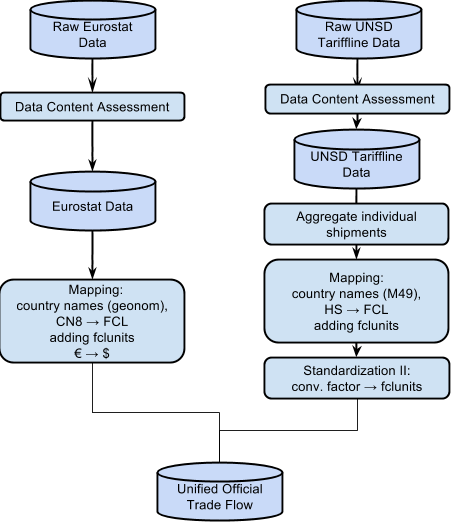
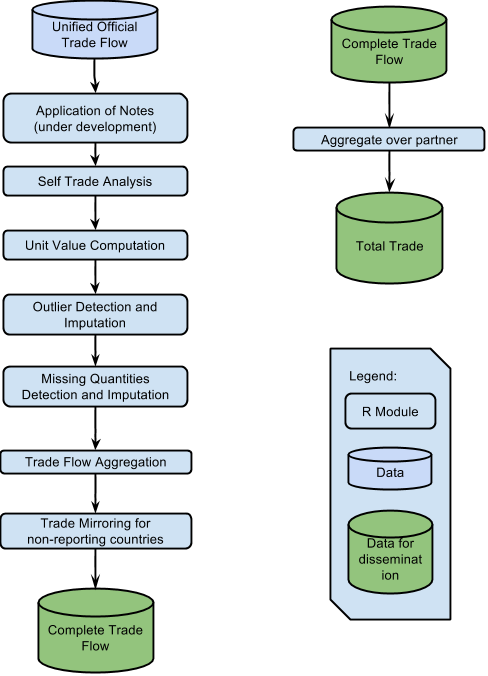

The trade module is divided in two submodules: `complete_tf_cpc`
and `total_trade_CPC`. Each module is year specific. This means
that, at the time being, the trade module runs indipendently for
each year. In order to run the `total_trade_CPC`, the output of
`complete_tf_cpc` is needed. All tables and graphs present in this
documentation are just examples. More details on the data are
given in the code.

# Complete tf cpc

## Data

Raw data are provided by the SWS Team (subunit of Team F) for both
UNSD Tariffline and Eurostat Data. The data is prefiltered as
shown below. In all cases, the module downloads only records of
commodities of interest. The HS chapters are the following:

  01, 02, 03, 04, 05, 06, 07, 08, 09, 10, 11, 12, 13, 14, 15, 16, 17, 18,
  19, 20, 21, 22, 23, 24, 33, 35, 38, 40, 41, 42, 43, 50, 51, 52, 53.

In the future, if other commodities become of interest for
the division, it is important to include additional chapters in
the first step of the downloading.

  ##   reporter partner       hs flow year     value weight qty qunit    hs6
  ## 1       90     458     3303    1 2009  54.75252     NA  NA     1   3303
  ## 2      184      36 07121000    1 2009 634.93650     NA  NA     1 071210
  ## 3      184      36 09011200    1 2009 470.57794     NA  NA     1 090112
  ## 4      184     554 12100000    1 2009 544.94550     NA  NA     1 121000
  ## 5      184     504 21050020    1 2009 379.96200     NA  NA     1 210500
  ## 6       90      36     5203    1 2009  36.37752     NA  NA     1   5203

### Eurostat

- only numeric codes of reporters and partners are kept (letters
  are not allowed).

- only numeric CN8 codes (`hs`) are kept (letters are not
  allowed).

- only `stat_regime` equal to 4 is kept.

    ##   reporter partner       hs flow year  value weight   qty    hs6
    ## 1       11      10 85193000    2 2009  83.96    2.2  1010 851930
    ## 2       11      10 85198121    1 2009  17.89    0.2  5023 851981
    ## 3       11      10 85198121    2 2009 243.69    7.3 13894 851981
    ## 4       11      10 85198125    1 2009   1.06    0.0     5 851981
    ## 5       11      10 85198125    2 2009  17.07    0.0   171 851981
    ## 6       11      10 85198131    1 2009   9.90    0.0   159 851981

### UNSD

- only numeric HS (`hs`) codes are kept (letters are not
  allowed). If any codes are still alphanumeric please ask team
  F to check, since this step is performed by them.

## Process

### Aggregate UNSD Tariffline individual Shipments

The tariffline data from UNSD contains multiple rows with
identical combination of reporter / partner / commodity / flow /
year / qunit. Those are separate registered transactions and the
rows containinig non-missing values and quantities are summed.

### Mapping UNSD Tariffline and Eurostat data

At this stage a standardization/mapping step is performed. The
details are divided between UNSD Tariffline and Eurostat due to
the nature of the differences among the two datasets.

#### UNSD Tariffline {-}

1. UNSD Tariffline data reports area code with Tariffline M49
   standard (which are different for official M49). The area code
   is converted in FAO country code using a specific convertion
   table provided by Team ENV. Area codes not mapping to any FAO
   country code or mapping to code 252 (which correponds to
   undefined areas) are separately saved and removed from further
   analyses.

    ##     m49 fao
    ## 164 270  75
    ## 26  280  79
    ## 294 716 181
    ## 241 634 179
    ## 38  471 252
    ## 106  51   1

1. The flow codes of re-Import (code 4) are recoded into Import
   (code 1) and codes of re-Export (code 3) to Export (code 2).
   This procedure is applied following UNSD standards:

   > Exports of a country can be distinguished as exports of
   > domestic goods and exports of foreign goods. The second class
   > is generally referred to as re-exports. The exports shown in
   > our database contain both the exports of domestic and foreign
   > goods. Re-exports are exports of foreign goods in the same
   > state as previously imported; they are to be included in the
   > country exports. It is recommended that they be recorded
   > separately for analytical purposes. This may require the use
   > of supplementary sources of information in order to determine
   > the origin of re-exports, i.e., to determine that the goods
   > in question are indeed re-exports rather than the export of
   > goods that have acquired domestic origin through processing.
   > Re-imports are goods imported in the same state as previously
   > exported. They are included in the country imports. It is
   > recommended that they be recorded separately for analytical
   > purposes. This may require the use of supplementary sources
   > of information in order to determine the origin of
   > re-imports, i.e., to determine that the goods in question are
   > indeed re-imports rather than the import of goods that have
   > acquired foreign origin through processing. There are several
   > reasons why an exported good might return to the country of
   > origin. The exported good might be defective, the importer
   > might have defaulted on payments or cancelled the order, the
   > authorities might have imposed an import barrier, or demand
   > or prices in the country of origin might have made it
   > worthwhile to bring the good back.

   See:
   http://unstats.un.org/unsd/tradekb/Knowledgebase/Reexports-and-Reimports

1. Set all HS codes to the maximum length (by reporter / flow).

1. Commodity codes are reported in HS codes (*Harmonized Commodity
   Description and Coding System*). The codes are converted in FCL
   (*FAO Commodity List*) codes. This step is performed using a
   table incorporated in the SWS. In this step, all the mapping
   between HS and FCL code is stored. If a country is not included
   in the package of the mapping for that specific year, all the
   records for the reporting country are removed. All records
   without an FCL mapping are filtered out and saved in specific
   variables.

    ##    validyear area flow   fromcode     tocode  fcl
    ## 1         NA   81    2 0407001900 0407001900 1062
    ## 2         NA  154    2 2009291100 2009291100  510
    ## 3       2009  157    1 0714200090 0714200090  122
    ## 4         NA  211    1   20059910   20059910  472
    ## 5         NA   84    2   02073685   02073685 1075
    ## 6         NA  101    2  230610000  230619999  332
    ## 7         NA   13    2   19052000   19052999   22
    ## 8         NA  236    2 0204210000 0204210000  977
    ## 9         NA  134    1   04069019   04069019  904
    ## 10        NA    9    1   09012100   09012199  657

1. Information of the FCL units is added.

    ##   fcl fclunit
    ## 1  15      mt
    ## 2  16      mt
    ## 3  17      mt
    ## 4  18      mt
    ## 5  19      mt
    ## 6  20      mt

1. Data convertion of units of measurements are applied to meet
   FAO standards, where all weights are reported in metric tonnes,
   animals in heads or 1000 heads and for some commodity just the
   value is provided.

1. Commodity specific conversions are added.

#### Eurostat {-}

1. Eurostat classifies areas in their geonomenclature. These codes
   are converted in FAO country codes using a specific convertion
   table, stored in the SWS, provided by Team B/C.  Area codes not
   mapping to any FAO country code or mapping to code 252 (which
   correpond undefined areas) is reported and the records for
   these area codes are removed.

    ##   ComM49 FAO         Name
    ## 1      1  68 France      
    ## 2      2  15 Belg.-Luxbg 
    ## 3      3 150 Netherlands 
    ## 4      4  79 Fr Germany  
    ## 5      5 106 Italy       
    ## 6      6 229 Utd. Kingdom

1. Commodity codes are reported in CN8 codes (*Combined
   Nomenclature 8 digits*). The codes are converted in FCL (*FAO
   Commodity List*) codes. This step is performed using the same
   package (`hsfclmap`) as for UNSD Tariffline. If a specific
   record has a CN8 code not mapping to any specific FCL code,
   then the record is reported and removed. If a country is not
   included in the package of the mapping for that specific year,
   all the records for the reporting country are removed.
   
   Eurostat data are already provided in the correct units of
   measurements and do not need futher conversions. (No need of
   example, same as before).

1. Information of the FCL units is added. This step is
   straighforward since for Eurostat the units are already
   correct. (No need of example, same as before).

1. Some commodity specific conversions are needed as Eurostat
   reports the figures in a different unit with respect to FAO.

1. Values are converted from EUR to USD using the table, stored in
   the SWS, with avarage EUR/USD exchange rate for each year
   provided by Team B/C.

    ##   Year ExchangeRate
    ## 1 2000     0.924020
    ## 2 2001     0.892860
    ## 3 2002     0.946000
    ## 4 2003     1.131200
    ## 5 2004     1.243304
    ## 6 2005     1.245755

### Unified Official Trade Flows Dataset

UNSD Tariffline and Eurostat datasets are ready to be merged
togheter. From UNSD Tariffline all the European countries are
removed and the final tables has all the countries worldwide.

### Standardization, editing and outlier detection

#### Application of Notes {-}

Perennial and yearly specific notes are mdb files provided by the
Team B/C already saved in a R friendly dataset. The notes might be
of different nature. They might be a multiplicative factor, or
forcing a value. More information about the notes can be provided
by team B/C. The notes might be year specific or for all years (in
this case reported as NA) and might refer to HS or/and FCL codes.
This notes (or adjustments) were developed during the years and
they are available from 1997 to 2013. Notes of 2014 are copied
from notes in 2013, as a partial solution, but this need future
work in the future.

Comparing results between the new and the old procedure showed
that sometimes the discrepancies between the two results are due
to the application of the notes.

More details on how to read the notes can be given by team B/C.

  ##   year flow      hs  fcl partner weight  qty value special reporter
  ## 1 2012    1      NA   17      NA     10 <NA>  <NA>    <NA>        8
  ## 2 2005    2      NA 1168      NA    100 <NA>  <NA>    <NA>       11
  ## 3   NA   NA      NA  836      NA    0.6 <NA>  <NA>    <NA>       52
  ## 4 2013    4      NA  702     194    0.1 <NA>  <NA>    <NA>       13
  ## 5 2011    1      NA 1061      NA    0.1 <NA>  <NA>    <NA>       37
  ## 6 2013    2 9030000  671     231     10 <NA>  <NA>    <NA>       33

#### Unit Values computation {-}

For each record having both quantity and value (thus excluding all
commodity reported just as value), the unit of value ($u_v$) is
computed as following:

  $$u_v = \frac{qty}{value}$$

#### Outlier Detection and Imputation {-}

Based on the units of measurement we might have cases of anomalous
observations (outliers). The target variables are traded
quantities so the outlier test on the unit values is a tool to
correct quantity data. Outliers are calculated based on the
distribution of the logarithm of the unit of value for the same
country, year and flow at the HS level (tariffline level). The
reason to identify the outlier at the HS level is due to the fact
that, under the same FCL code, different commodity might fall
(i.e. maize seed and seed).

Outliers are detected using Tukey's procedure:

$$\text{x is outlier if} \begin{cases}
    x < Q1 - k * IQR, & \text{lower outlier},\\
    x > Q3 + k * IQR, & \text{upper outlier}.
  \end{cases}$$

where $Q1$ and $Q3$ are the first and third quartile,
respectively, $IQR$ is the interquartile range ($IQR = Q3 - Q1$),
and $k$ is a coefficient for the outlier detection (set to 1.5 as
suggested by Tukey). See: Tukey, John W., (1977), Exploratory Data
Analysis, Addison-Wesley. 

Traded quantities that are identified as outliers are then
corrected by dividing the corresponding value (which remain fixed)
by an appropriate median unit value, which is calculated in a
specific-to-generic fashion (in all cases, the unit values are
calculated separately for imports and exports). A first attempt is
done by calculating unit values at the most specific HS level
(i.e., the one at which the quantity is expressed). If the number
of partners for which this unit value can be calculated is greater
than a certain threshold (currently 10) the median unit value
across partner is calculated and used for imputation. If the first
attempt fails (i.e., it is not possible to calculate a unit value
at the most specific HS level), then the same approach is used by
taking into account more generic HS levels, in particular at eight
and six digits, and the most specific level for which a sufficient
number of partners is available is used for calculating the median
unit value. Usually a suitable median can be calculated at the
8-digit level or, at least, at the 6-digit level. However, if the
previous strategies fail, which implies that there is not a
sufficient number of partners in order to calculate the median,
two attempts at calculating a non reporter specific median unit
values (i.e., median unit values valid for all reporters) are
sequentially undertaken: by HS and by FCL. In the most difficult
cases it should be possible to calculate the median unit value by
HS, thus that at the FCL level is used as the strategy of last
resort. Actually, for completeness sake, the very last fallback is
the median unit value by flow. This is the most generic unit value
that can be used for imputation and is calculated just for
precaution as it is very unlikely that an appropriate more
specific median unit value can not be calculated.

In short, the first one of the following median unit values that
can be calculated is used for imputation (import and export unit
values are always calculated separately):

1. most specific HS code, across partners;
1. 8-digit HS level, across partners;
1. 6-digit HS level, across partners;
1. most specific HS code, across reporters;
1. FCL code of the most specific HS code, across reporters;
1. by flow (whithout taking into account any commodity code).

**Remark**: in the module, one of the input parameter for the user
is the outlier coefficient. By default this is set up to 1.5.
More info regaring the outlier coefficient is given in the Future
Work section.

#### Missing Quantities Detection and Imputation {-}

For records in which the commodity has to be reported in quantity
and the quantity is missing and the value is present, the
corresponding quantity is imputed dividing the corresponding value
by the median of the units of value of the corresponding commodity
(HS level/country/flow/year)

### Mirroring and Balancing

The module produce the list of non-reporting countries: these are
the countries present as partners but absent as reporters. For
these countries the mirroring routine is applied: the
corrisponding trade of the non-reporting countries are extracted
from the partners inverting the flows. The quantities are the same
while the values are corrected by a factor of 12% due to the
CIF/FOB conversion. This need more work, details in the Future
Work section.

## Flags

Both records with imputation with outlier or mirroring imputation
have a special flag:

- flagObservationStatus: this flag is **I**, which means imputed

- flagMethod: this flag is **e**, which means estimated with a
  statistical algorithm.

For all the other records empty string flags are saved.

More information on the Flag is given in the Future Work section.

## Convertion to FAO SWS standards

At this point the table is almost ready to be save in the SWS.
Additional mapping and aggregation are necessary in order to
respect the SWS standards:

- Conversion of FCL into CPC codes. This conversion is based on
  the table of conversion 2.1 expanded. If some FCL codes are not
  mapped into CPC ones, the corresponding records are filtered
  out. Since the mapping between FCL and CPC is one-to-one there
  is no aggregation at this point. The routine just add the
  corresponding CPC code.

- Conversion from FAO country code to M49.

- Each row of the final output must be or quantity or value
  specific, while so far the module keeps this information in one
  row. We therefore split this information in two separated rows.

The first submodule saves the final output in the
`completed_tf_cpc_m49` dataset, within the trade domain.

# Total trade CPC

This second submodule uses as input the output of the previous
submodule. These two modules are separated because the two outputs
are needed for different purposes, not only, the resulting
matrices have different dimensions.

This module aggregates total trade flow by reporting country for
partners countries to a single total trade for each unique CPC
commodity code.

The module save the ouput into the dataset `total_trade_cpc_m49`,
within the trade domain.

# Flow Chart Process

# Future work

## Validation Steps

This section represents the most high priority task for the trade
module.

### Raw Data - Data content assessment

- In the vignettes folder, a sample of pre-analysis is given, but
  not integrated in the main module (file name:
  preanalysis\_2009.Rmd). The pre-analysis script calculate the
  total number of records for both Eurostat and UNSD Tariffline
  datasets and the distribution of length of the commodty HS codes
  (for UNSD Tariffline and CN8 for Eurostat) is performed. For
  each country we report if data includes imports, exports,
  re-exports and re-imports at all possible length. All records
  with hs-length (for UNSD Tariffline) or CN8-length (for
  Eurostat) less than 6 are removed. The pre-analysis script
  produces a html file.

- The pre-analyses of the assessment of the data has to be
  integrated in the module. The script is just a guide but
  improvements are needed (i.e. tables).

### Report and check of discarded elements after mapping

- At the moment the module is saving the unsolved mapping records
  in a separated variable, but not reported anywhere.

- Each mapping routine might produce some unsolved mapping. All
  unsolved mapping should be reported and possibly solved in the
  future.

### Destination Table

- The `complete_tf_cpc` module produces output for all the records
  passing all the routines and not filtered out. The module does
  not check if any commodity is missing. A possible solution would
  be to have a destination table with all the commodities of
  interest and the module should fill the destination table. In
  this way the output validation step should be achieved.

## Time Series Analysis

- Upon availability of time-series data, a check of the CPC-based
  unit values across the time series should be performed.
  Differentiation between errors in the order of magnitude on
  quantities and values (time series) and outliers (cross
  section). An additional submodule of imputation of missing data
  using time series analysis would be a solution.

## CIF/FOB

- The CIF/FOB correction for mirroring is, at the time being, set
  up to 12%. This has been suggested by team B/C.

- Additional work might be done in order to assess if the estimate
  is appropriate. There might be different range of percentages
  for different type of countries and by distance between
  reporters and partners. A study can be conducted on available
  records on both side: this means records for which the commodity
  is reported by the reporter and by the partner.

## Re-import and Re-export

- All re-imports and re-exports are considered as, respectively,
  imports and exports.

- More study might be conducted in order to identify countries
  more prone to report re-import and re-export.

## Self Trade Analysis

- A script within the vignette folder, named selftrade.R, has been
  used to perform some simple analyses on the self trade. The
  script filter all records for which the reporter and the partner
  are the same. The script compute the sum of all value across all
  commodities per country (Figure 1), or the sum of all the value
  for each commodity across all countries (Figure 2). In this way
  we can spot out the countries reporting massive self trade as
  well as which are the main commodities reported in self trade.

  This is an example of the graphical output (still part of the
  script).

  

  

- This might be incorporated in the module and might produce
  suitable output within the SWS. More documentation is needed.

## Pseudo-automatic mapping of commodities

- An additional method has to be added in the future: the
  algorithm should try to trim the code not mapped and try to map
  them with shorter HS codes. If any of shorter codes (from right
  to left) are then not mapped, we can definitely discard the
  record. If a specific record has a HS code not mapping to any
  specific FCL code, then the record is reported and removed.

## Mapping from HS to FCL

- In the module for commodities we have 2 different mappings. From
  HS to FCL, using mapping produced by team B/C and then from FCL
  to CPC 2.1. This mapping is available for the following years:
  1997, 2001, 2002, 2003, 2004, 2005, 2006, 2007, 2008, 2009,
  2010, 2011, 2012, 2013. The following years are missing: 1998,
  1999, 2000. The mapping for 2014 has been copied from year 2013,
  but the results need to be checked.

- In the future direct mapping from HS to CPC has been asked from
  management. A possible solution, where adding the column with the
  one-to-one CPC codes has been sent to Carola (09.06.2016), but
  anyway this needs revision
  ([link](https://drive.google.com/drive/folders/0B_Z6srBtmyJRUmtaaXphTllZUDA))

## Mapping from Comtrade M49 and Geonomenclature directly to M49

- The country codes, as the commodity ones, have two steps of
  mapping. This results in higher risk of data loss due to
  unsolved mapping.

- A direct map from Comtrade M49 (Tariffline UNSD) to M49 and from
  Geonomenclature (Eurostat) to M49 would be ideal.

## Flag correction

- This activities have high priority

    1. When mirroring is performed, the quantity will stay official,
       while the value will change flag (high priority)

    2. In case of official figure the methodology has to be 'h' and
       not empty.

## Outlier identification

- Outliers are identified by using the median unit value by the
  most specific HS code. There is a problem in this procedure as
  sometimes the number of reporters for the specific HS code can
  be low. This is what led to the reimplementation of the
  imputation procedure that now uses a specific-to-generic median
  unit value calculation. Thus, a similar procedure should be
  implemented for *detecting* outliers.

## Outlier coefficient

- The outlier coefficient is set up to 1.5. The outlier
  coefficient is a input parameter of the `complete_tf_cpc`
  submodule.

- After discussion with team B/C (23.06.2016) a specific analysis
  has to be perfomed to understand what is the best coefficient to
  be used in order to reflect old results. After this analysis,
  the outlier coefficient should be hard-coded within the code of
  the module without letting the user to modify it anymore.

## Food-aid

- This has to be incorporated also to understand the trend in a
  time series analysis. This needs special study to understand if
  we can get the data just from the exports not reported as
  imports in the partner.

# Disclaimer {#disclaimer .unnumbered}

This Working Paper should not be reported as representing the
official view of the FAO. The views expressed in this Working
Paper are those of the author and do not necessarily represent
those of the FAO or FAO policy. Working Papers describe research
in progress by the authors and are published to elicit comments
and to further discussion.

<!-- vi: set ft=markdown tw=66 ts=2 sts=0 et sw=2 sta: -->
