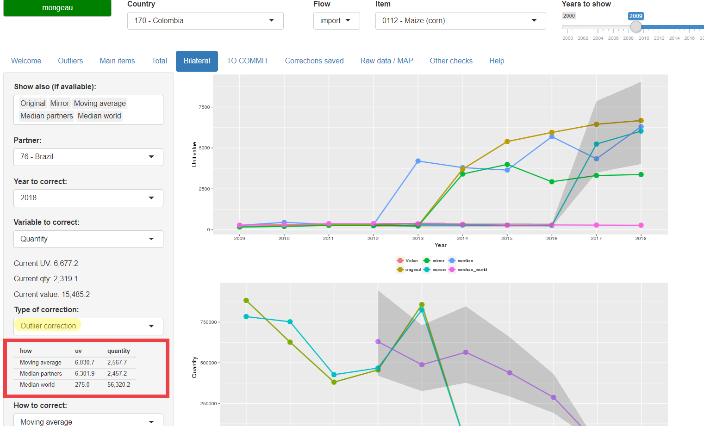
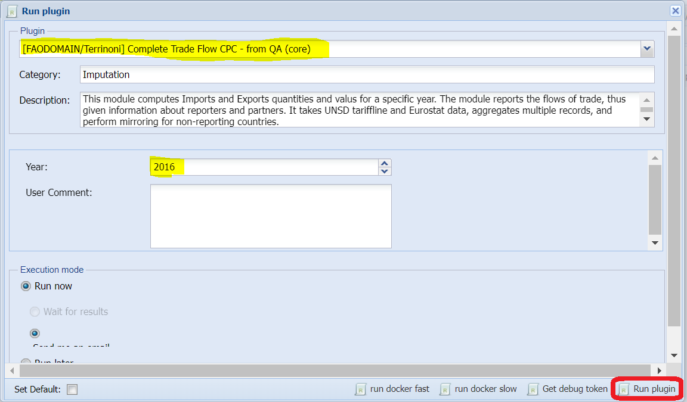
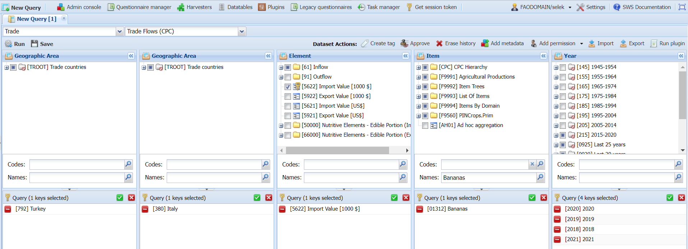

```{r setup, echo=FALSE}
knitr::opts_chunk$set(echo = FALSE)
# File in vignettes/Documentation
examples <- readRDS('examples.rds')
```

# Introduction

The trade processing system of the Economic and Social Development
Department (ESS) of the Food and Agriculture Organization of the United
Nations (FAO) involves two main steps: raw data treatment and data
validation.

Raw data treatment includes all operations required to save trade data in
FAO-specific datasets with predefined structures, from bilateral raw data.
These operations can be roughly summarised as: data harvesting, data content
assessment, countries and items codes conversions/aggregation,
standardisation of units of measurement, calculation of unit values,
imputation of reporter's missing or incomplete quantities, imputation of
data for missing countries through "mirroring". At the end of these
operations, bilateral and total trade data is saved to FAO's Statistical
Working System (SWS)[^sws] datasets.

[^sws]: The appendix "Statistical Working System" gives background
information on what the SWS is and how trade-related information is
organised therein. For now, it is sufficient to say that the "Statistical
Working System is a corporate platform used in FAO for the processing and
storage of statistical datasets, providing the framework needed to use the
same methods, standards, classifications and approaches within statistical
processes."
<http://www.fao.org/economic/ess/ess-home/ess-about/statistical-methods/en/>

Two R[^r] routines (called also plugins)[^plugins] deal with this first phase:
"Complete Trade Flow CPC" and "Total Trade CPC". The former deals with raw bilateral
data, applies the operations mentioned before, and saves data to the
`Bilateral Trade Flow (CPC)` SWS dataset; the latter takes as input the data
obtained as output from the "Complete Trade Flow CPC" plugin, aggregate all
bilateral partner data for each combination of reporter/flow/item,
calculates the aggregated unit values, and saves data to the `Bilateral
Trade Flow (CPC)` SWS dataset.

[^r]: "R is a language and environment for statistical computing and
graphics." <https://www.r-project.org/>

[^plugins]: The computational part of the SWS is composed of a series of
"plugins", which are R scripts that are run on the R server available in
SWS. These plugins take as input data available as SWS datasets/datatables,
carry out statistical procedures based on these data and parameters, then
save processed data back to SWS datasets/datatables (though some plugins'
scope is not saving data, but computing some analysis that is sent back to
the user by email). More information of hwo the SWS works is given in the
appendix "Statistical Working System".

When data have been processed and saved to the datasets, data validation by
ESS analysts takes place. This is done by means of complimentary tools that
detect outliers or other type of data that deserves verification, and allows
analysts to correct flows in an informed way by means of an interactive
validation tool.

In this document, an overall narrative of what the various components do is
presented.  A detailed (and more technical) step-by-step illustration of the
modules/tools is given in separate documents.

# Raw data processing

The sources of bilateral raw data are the United Nations Statistics Division
(UNSD) for non-European countries, and Eurostat for European countries. In
order for these two data sources to be combined and saved into a single SWS
dataset they need to pass trough different processing steps, which will be
explained in this section.

## Data harvesting

**TODO: HERE A DESCRIPTION OF THE WORKFLOW FOLLOWED BY FRANO WILL BE
PRESENT, WITH A DESCRIPTION OF THE SHINY TOOL FRANO SAID IS AVAILABLE FOR
DOING THE HARVESTING.**

Data of relevance for ESS trade falls under the following "Harmonized
System" (HS)[^hs] chapters[^chapters]:

[^hs]: "The Harmonized Commodity Description and Coding System generally
referred to as "Harmonized System" or simply "HS" is a multipurpose
international product nomenclature developed by the World Customs
Organization (WCO). It comprises about 5,000 commodity groups; each
identified by a six digit code, arranged in a legal and logical structure
and is supported by well-defined rules to achieve uniform classification.
The system is used by more than 200 countries and economies as a basis for
their Customs tariffs and for the collection of international trade
statistics. Over 98 % of the merchandise in international trade is
classified in terms of the HS."
<http://www.wcoomd.org/en/topics/nomenclature/overview/what-is-the-harmonized-system.aspx>

[^chapters]: "The HS comprises approximately 5,300 article/product
descriptions that appear as headings and subheadings, arranged in 99
chapters, grouped in 21 sections. The six digits can be broken down into
three parts. The first two digits (HS-2) identify the chapter the goods
are classified in, e.g. 09 = Coffee, Tea, Maté and Spices. The next two
digits (HS-4) identify groupings within that chapter, e.g. 09.02 = Tea,
whether or not flavoured. The next two digits (HS-6) are even more
specific, e.g. 09.02.10 Green tea (not fermented)... Up to the HS-6 digit
level, all countries classify products in the same way (a few exceptions
exist where some countries apply old versions of the HS)."
<https://unstats.un.org/unsd/tradekb/Knowledgebase/50018/Harmonized-Commodity-Description-and-Coding-Systems-HS>

```{r}
knitr::kable(dplyr::tribble(
  ~chapter, ~description,
      "01", "Animals; live",
      "02", "Meat and edible meat offal",
      "03", "Fish and crustaceans, molluscs and other aquatic invertebrates",
      "04", "Dairy produce; birds' eggs; natural honey; edible products of animal origin, not elsewhere specified or included",
      "05", "Animal originated products; not elsewhere specified or included",
      "06", "Trees and other plants, live; bulbs, roots and the like; cut flowers and ornamental foliage",
      "07", "Vegetables and certain roots and tubers; edible",
      "08", "Fruit and nuts, edible; peel of citrus fruit or melons",
      "09", "Coffee, tea, mate and spices",
      "10", "Cereals",
      "11", "Products of the milling industry; malt, starches, inulin, wheat gluten",
      "12", "Oil seeds and oleaginous fruits; miscellaneous grains, seeds and fruit, industrial or medicinal plants; straw and fodder",
      "13", "Lac; gums, resins and other vegetable saps and extracts",
      "14", "Vegetable plaiting materials; vegetable products not elsewhere specified or included",
      "15", "Animal or vegetable fats and oils and their cleavage products; prepared animal fats; animal or vegetable waxes",
      "16", "Meat, fish or crustaceans, molluscs or other aquatic invertebrates; preparations thereof",
      "17", "Sugars and sugar confectionery",
      "18", "Cocoa and cocoa preparations",
      "19", "Preparations of cereals, flour, starch or milk; pastrycooks' products",
      "20", "Preparations of vegetables, fruit, nuts or other parts of plants",
      "21", "Miscellaneous edible preparations",
      "22", "Beverages, spirits and vinegar",
      "23", "Food industries, residues and wastes thereof; prepared animal fodder",
      "24", "Tobacco and manufactured tobacco substitutes",
      "33", "Essential oils and resinoids; perfumery, cosmetic or toilet preparations",
      "35", "Albuminoidal substances; modified starches; glues; enzymes",
      "38", "Chemical products n.e.s.",
      "40", "Rubber and articles thereof",
      "41", "Raw hides and skins (other than furskins) and leather",
      "43", "Furskins and artificial fur; manufactures thereof",
      "50", "Silk",
      "51", "Wool, fine or coarse animal hair; horsehair yarn and woven fabric",
      "52", "Cotton",
      "53", "Vegetable textile fibres; paper yarn and woven fabrics of paper yarn"
))
```

In Table \@ref(tab:rawunsd), an example of filtered UNSD data is shown
(variable names have been modified). It contains information on the
reporter, partner, flow (1 = imports; 2 = exports; 3 = re-exports; 4 =
re-imports), HS codes (variable length), monetary value (in USD dollars),
weight (in kilograms), supplementary quantity, the unit in which the
supplementary quantity is given (`qunit`, e.g., 8 = kilograms, 7 = liters),
and the chapter.

```{r rawunsd}
knitr::kable(examples$tldata_raw, row.names = FALSE, caption =
'Subset of Tariff line data', digits = 2)
```

In Table \@ref(tab:raweurostat), an example on filtered Eurostat data is
reported (also in this case, the original variable names were
modified). The main differences are: reporter and partner codes
are "geonomenclature" codes (in UNSD they are "M49"); the HS
length is maximum 8-digits; monetary values are in thousands of
euros; weight is reported in tonnes; the supplementary quantity is
always commodity specific (in Tariff line data it can happen that
the same HS code is reported in different units).


```{r raweurostat}
knitr::kable(examples$esdata_raw, row.names = FALSE, caption =
'Subset of Eurostat data', digits = 2)
```

Besides filtering by chapters, only some HS codes inside the chapters are
considered. These codes are given in the `hs6faointerest` datatable, of
which Table \@ref(tab:hsinterest) shows a subset of ten codes.

```{r hsinterest}
# If a single column, the caption is not shown and next table
# has a n+1 number. Bug?
knitr::kable(dplyr::mutate(examples$hs6faointerest, ` ` = ''),
row.names = FALSE, caption = 'HS-6 codes of interest')
```

For both UNSD and Eurostat data, codes that contain non-numeric characters
are dropped.[^nonnumeric] An example of this can be seen in the Eurostat
table showed before (Table \@ref(tab:raweurostat)), which contains the
`10MMM000` code. The only information of the transaction reported with that
code is that it corresponds to some cereal (chapter 10 is "Cereals").
Besides that, it is difficult, or even impossible, to assign it to a
specific cereal type (e.g., wheat or barley, which are recorded as `100110`
and `100300`, respectively).  Thus, given the difficulty in assigning codes
with non-numeric characters to detailed items, and given that these cases
are relatively marginal, the codes are removed from the raw data and no
attempt at assigning them is done.

[^nonnumeric]: Alphanumeric codes (i.e., codes that have non-numeric
characters) happen mainly because a country does not want to disclose the
full information of a given transaction (or set of transactions).

So far, the discussion has evolved by mentioning only the HS system as the
standard coding for items, but the raw data obtained by UNSD/Eurostat does
not come (usually) in standard HS codes. Indeed, UNSD data comes as
Tariffline, i.e., HS codes that may (and usually do) extend to more than 6
digits, usually 8, 10, 12.  These codes are not directly comparable across
countries, as each country may have a description for such codes that is
relatively different from that of other countries. As for Eurostat data, it
comes with "Combined Nomenclature" (CN) codes at 8 digits (CN8), which are
EU extensions of HS codes[^cn].

[^cn]: <https://trade.ec.europa.eu/tradehelp/eu-product-classification-system>

For Eurostat data, only `stat_regime` equal to 4 is kept[^eustatregime]:

  > In this system *["Statistical regime 4" or "Total trade"]*, the
  > recorded aggregates include all goods entering or leaving the
  > economic territory of a country with the exception of simple
  > transit trade. In particular, all goods received into customs
  > warehouses are recorded as imports, regardless of whether they
  > subsequently go into free circulation in the Member State of
  > receipt. Similarly, outgoing goods from customs warehouses are
  > included in the general trade aggregates, at the time they
  > leave the Member State.

[^eustatregime]: See pag. 9 in *DG Trade Statistical Guide*, June 2016, <http://trade.ec.europa.eu/doclib/docs/2013/may/tradoc_151348.pdf>


## Raw data: SWS datatables vs. RDS files

As seen above, raw UNSD and Eurostat data are saved into SWS datatables. All
plugins, including then the "Complete Trade Flow CPC" and "Total Trade CPC"
plugins, read raw data stored directly in the SWS database. This, however,
for large amount of data as the trade raw data (which generally contain
more than 15 million rows) turns out to be a time-expensive process. For
instance, the process of getting the raw UNSD and Eurostat data takes by
itself around 40 minutes. In order to overcome this issue, the "Complete
Trade Flow CPC" is designed to use RDS files[^rds] stored in the SWS "R shared
drive"[^shareddrive]. Reading these files takes less than 2 minutes, so the benefits in
terms of saving reading (and, thus, overall time employed by the plugin to
complete) time is evident.

[^rds]: RDS is a file format used to read/write serialized data in R.

[^shareddrive]: The "R shared drive" is a folder in the SWS server where R
  plugins can write and read data to/from, and can be accessed also by local
  PCs in the FAO network by means of a Samba service.

A more detailed information on how to access the raw data files stored in
the R shared drive, and how to updated them, will be given in
"Accessing/updating files in the R shared drive" Appendix.


## "Pre-Processing Report" plugin

Data content assessment is carried out by means of different tables
(pre-processing tables) compiled from raw data, which give a first idea of
the completeness and quality of the data. For instance, if in a given year
transactions of a country are 70% less than those reported the previous
year, it may indicate that the country file is incomplete[^incomplete] so
that it can be decided to treat the country as a non-reporter (so that
mirroring will be used for imputing all its transactions in that year)
until its data is more complete.[^contact]

[^incomplete]: Given the country reports at the same number of HS digits.
Reports also contain this information.

[^contact]: This is the final decision if no other option in available. What
happens when analysis on the raw data content is carried out and some
country data seems incomplete is that the data providers are contacted by
an FAO officer who will require additional details or other useful
information that can help understanding what is the source for such
incompleteness. For instance, while it can well be that a country has
reported a number of transaction in line with previous years, it may
happen that for a large amount of them do not contain any information on
quantity. In this case the provider is contacted so to understand whether
the country actually reported the data like that, or there was some other
issue that made the quantity information unavailable.

In order to run this plugin, one of the datatables indicated below (found in
the "trade-reports" domain) need to be selected, then the user will need to
click on the button shown in the Figure below, select "Run plugin...", and
select "Pre-Processing Report" in the popup window that will open.

```{r, echo = FALSE}

```

All tables report the "m49" column, indicating the M49 code assigned to the
country as it wilkl be saved in SWS, and a "code" column containing the
original code assigned by the country either by UNSD (M49-comtrade) or
Eurostat (geonom).

### "Reporters by years"

This table reporter whether the country is available in the raw data file
as a reporter, and it is indicated with an "X" in the specific
country/year combination.

```{r, echo = FALSE}

```
In the Figure above, for instance, Myanmar is among reporter countries in
2001 and 2010, while in the other years it is not a reporter.

### "Non-reporting countries"

A country can be non reporter because it did not report any flow, or because
it did not report imports or exports. Scope of this table is showing this
information. Countries that did not report imports and exports are marked
with a "9", while those that did not report imports or exports are marked
with a "1" or "2", respectively.

```{r, echo = FALSE}

```
In the example shown in the Figure, Cabo Verde was a complete non-reporter
in 2001 and 2002, while it reported only imports in 2008 (a "2" indicated
that exports are missing).


### "Number records by reporter/year"

This table contains by country/year/flow, the minimum and maximum number of
HS digits reported by the country (`hs_min` and `hs_max`; the number of
different HS digits is shown by the `hs_n` variable), whether there has
been a difference in this two variables with respect to the previous year
(`hs_min_diff` and `hs_max_diff`), the number of records (`records_count`)
and the percentage variation of record counts with respect to the previous
year (`records_diff`).

```{r, echo = FALSE}

```

In the Figure above, it is possible to see that Barbados reported 1,022
export transactions at the HS 8-digit level in 2001, while it reported 1,029
transactions in 2002 (an increase of 0.685%, as indicated by the
`records_diff` variable), which are either at the 6- and 7-digit level.

### "Import and export content check"

This table shows by country/year whether the country reported import/exports
(and eventuallu re-imports and re-exports) and indicates it with an "X".

```{r, echo = FALSE}
knitr::include_graphics("assets/ppr_4.png")
```

Except Myanmar, in the previous Figure all countries reported imports and
exports (Myanmar reported only imports); Sri Lanka also reported re-exports.

### "Check qty and value included"

This reports shows whether information is missing for quantity or value by
country/flow. If the information is missing, this is indicated with a "1".

**NOTE: THIS NEED TO BE CHANGED, SO TO DO IT AS IN OTHER TABLES WHERE BINARY
INFORMATION IS GIVEN WITH X/BLANK INSTEAD OF 1/0.

```{r, echo = FALSE}

```

### "Missing data by report"

This table contains information of missing or zero quantities by reporter
and year. This information is encoded as $noqty_F$ and $noqty_prop_F$, where
$F$ is the flow (import, export, re-import, re-export). The former indicates
how many observations are either missing or zero, and the latter is the
proportion of the former to the total number of observations.

In the example below, Sri Lanka had 735 quantity observations which were
either missing or zero, and the proportion of these to all of Sri Lanka's
exports was 8.72%.

```{r, echo = FALSE}

```

# Bilateral trade processing

After raw data have been harvested from UNSD/Eurostat, and after a decision
on data completeness and quality has been achieved, bilateral raw data can
be processed with the "Complete Trade Flow CPC" plugin. When this completes,
its output is saved to the "Bilateral Trade Flow (CPC)" dataset, were
bilateral transactions are saved by year as unique combinations of reporter and
partner M49 codes, CPC item codes, SWS element codes that represent the flow
and the type of variable (e.g., 5622 indicates imports in 1,000 US dollar,
while 5910 indicates exports in metric tons). Once bilateral transactions are
stored on SWS, these are aggregated by summing all partners for each
reporter/item/element/year combinations by the "Total Trade CPC" plugin and
saved into the "Total Trade (CPC)" SWS dataset.

This Section contains a description of the operations carried out by the
"Complete Trade Flow CPC" and "Total Trade CPC" plugins, devoting more space
to the former as it is the main plugin (the latter being basically an
aggregation plugin).

## "Complete Trade Flow CPC" plugin (bilateral transactions)

The "Complete Trade Flow CPC" plugin (SWS id: 5636) takes as input the raw
UNSD and Eurostat data and saves bilateral transactions for reporters and
partners expressed in M49 codes, items expressed in CPC codes, and elements
in SWS-specific element codes, in the "Bilateral Trade Flow (CPC)" SWS
dataset. In between, the plugin carries out several operations. These are
explained below.

### Aggregation of UNSD Tariff line shipments

The tariffline data from UNSD contains multiple rows with
identical `reporter`/`partner`/`commodity`/`flow`/`year`/`qunit`
combinations. See, e.g., the data reported in Table \@ref(tab:multipletl),
where for the same year/reporter/partner/flow/qunit there are 15 recorded
transactions involving the the item with code `22071090`.

```{r multipletl}
knitr::kable(examples$tldata_multiple, row.names = FALSE,
caption = 'Example of multiple transactions by
`reporter` / `partner` / `flow` / `year` / `hs`')
```

Multiple transactions can be aggregated, taking into account that
transactions with missing weight and/or quantity can be
aggregated with other transactions that have the same variables missing.

The results of the aggregation of the example reported in Table
\@ref(tab:multipletl) are shown in the Table \@ref(tab:multipleaggregate).
In this case, even if there is a unique combination of
`reporter`/`partner`/`flow`/`year`/`hs`, the rows are two: indeed, one
reports the aggregated transactions where the `weight` variable was
available, and the other reports the aggregated cases where it was missing.

```{r multipleaggregate}
knitr::kable(examples$tldata_multiple_aggregated, row.names = FALSE,
caption = 'Results of the aggregation of multiple transactions')
```

### Mapping UNSD Tariff line and Eurostat data

At this stage a standardization/mapping step is performed. The
details are divided between UNSD Tariff line and Eurostat due to
the nature of the differences among the two datasets.

#### UNSD Tariff line {-}

1. UNSD Tariff line data reports area code with Tariff line M49
   standard codes (which are different from official M49). The area
   code is converted in FAO country code using a specific
   conversion table provided by Team ENV. The table is contained
   in the `faoswsTrade` package as `faoswsTrade:m49faomap`. Table
   \@ref(tab:m49faomap) contains a subset of it.

   ```{r m49faomap}
   knitr::kable(examples$m49faomap, row.names = FALSE,
   caption = 'Subset of the M49 to FAO codes mapping table')
   ```

1. Countries that are not supposed to exist in the year for which
   the module runs are removed from the data (e.g., Serbia did not
   exist as a single official country before 2006). The information is
   retrieved from the `geographicAreaM49Reporter` SWS codelist. Table
   \@ref(tab:existingreps) contains some examples.

   ```{r existingreps}
   knitr::kable(examples$reporters_start_end_date, row.names = FALSE,
   caption = 'Subset of the tables with countries and their
   `startDate` and `endDate`')
   ```

1. European countries (as reporters) are removed, as Eurostat, which
   contains this information, data will be used.

1. Area codes that do not mapp to any FAO country code are removed and
   will be mirrored in a later step. All countries mapping to code
   252 (which corresponds to undefined areas) are mapped to the 896
   M49 code ("Other nei"). Table \@ref(tab:nonmappingcountries) show some
   examples.

   ```{r nonmappingcountries}
   knitr::kable(examples$unmapped_countries, row.names = FALSE,
   caption = 'Example of unmapped countries')
   ```

1. The flow codes of re-Import (code 4) are recoded into Import
   (code 1) and codes of re-Export (code 3) to Export (code 2).
   This procedure is applied following UNSD standards:

   > Exports of a country can be distinguished as exports of
   > domestic goods and exports of foreign goods. The second class
   > is generally referred to as re-exports. The exports shown in
   > our database contain both the exports of domestic and foreign
   > goods. Re-exports are exports of foreign goods in the same
   > state as previously imported; they are to be included in the
   > country exports. It is recommended that they be recorded
   > separately for analytical purposes. This may require the use
   > of supplementary sources of information in order to determine
   > the origin of re-exports, i.e., to determine that the goods
   > in question are indeed re-exports rather than the export of
   > goods that have acquired domestic origin through processing.
   > Re-imports are goods imported in the same state as previously
   > exported. They are included in the country imports. It is
   > recommended that they be recorded separately for analytical
   > purposes. This may require the use of supplementary sources
   > of information in order to determine the origin of
   > re-imports, i.e., to determine that the goods in question are
   > indeed re-imports rather than the import of goods that have
   > acquired foreign origin through processing. There are several
   > reasons why an exported good might return to the country of
   > origin. The exported good might be defective, the importer
   > might have defaulted on payments or cancelled the order, the
   > authorities might have imposed an import barrier, or demand
   > or prices in the country of origin might have made it
   > worthwhile to bring the good back.

   See:
   <http://unstats.un.org/unsd/tradekb/Knowledgebase/Reexports-and-Reimports>

1. HS codes are converted in FCL (*FAO Commodity List*)
   codes. More information on the HS-FCL-CPC mapping will be given below.

1. Information of the FCL units is added, i.e, to each FCL code
   its final unit of measurement is assigned.

   ```{r}
   knitr::kable(examples$fclunits, row.names = FALSE, caption =
   'Subset of FCL units')
   ```

1. Data conversion of units of measurements are applied to meet
   FAO standards, where all weights are reported in tonnes,
   animals in heads or 1000 heads and, for some commodities, just
   the value is provided. For example, if the originally-reported
   quantity is "units" and the FAO unit is "1000 heads", the
   quantity is divided by 1000. Some of these conversions, as the
   example just made, are simple mathematical conversions that
   involve multiplying by a fixed factor known *a priori*. Other
   conversions are less trivial and need to be obtained with
   information derived from within the data. This is handled in
   the next step

1. Non-livestock commodity specific conversions are added. If a
   quantity is originally expressed in "units", and weight is not
   available, a conversion factor for converting units into
   kilograms is required. In order to obtain these conversion
   factors, all transactions with non-standard quantities that
   have also the weight available are used to obtain "empirical
   conversion factors": weight are divided by quantity and the
   median by measurement of unit of this ratio is obtained:

   $$qw_u = \text{median}(\text{weight} / \text{quantity}_u)$$

   where $u$ is a given non-standard unit of measurement. This
   factor ($qw_u$) is the applied to all correspondent
   transactions that have no weight but are reported in unit $u$:

   $$\text{weight} = \text{quantity}_u \times qw_u$$

   To make this clear an example could be useful: suppose that a country
   does not report the weight of eggs, but reports units, in this case, we
   compute the median of the weight/quantity/1000 ratio for all countries
   where both weight and quantity are reported and then apply this median in
   order to have an idea of how many tonnes the reported quantities of that
   country weighs.[^weakconversion] This procedure is not applied to
   livestock: in this case, a country/item specific datatable exists where
   weights of livestock are present (next step).

1. For livestock, the conversion from weight to final units (head/1,000
   heads) where the reported unit is either missing or different from the
   final unit, is made by dividing the reported (or imputed as per previous
   steps) the weight by an average livestock weight by country and species.
   The table used has being compiled by both AGA division and by team CLFS,
   and is available in SWS as `Livestock weights` in the
   `trade-reference-files` domain. By calling these averages as $aw$, the
   final unit in heads/1,000 heads will be obtained as:

   $$\text{quantity} = \frac{\text{weight}}{aw}$$

[^weakconversion]: Probably a weak point of this procedure is that not in
  all countries eggs weigh the same, thus a more realistic approach would be
  to compute regional medians (e.g., for Thailand use the Asian median of
  the weight/quantity ratio). The first-best approach, in any case, would be
  to have speficic tables derived from external sources. This is currently
  under investigation.

#### Eurostat {-}

1. Eurostat classifies areas in their "geonomenclature" coding system. These
   codes are converted in FAO country codes using a specific conversion
   table, stored in the SWS in the `geonom2fao` datatable of the
   `trade-reference-files` domain. Table \@ref(tab:geonom2fao) contains the
   geonomenclature-FAO code correspondence table for some countries.

   ```{r geonom2fao}
   knitr::kable(examples$geonom, row.names = FALSE, caption =
   'Subset of geonom (Eurostat) to FAO codes mapping')
   ```

   Area codes not mapping to any FAO country code are reported and
   the records for these area codes are removed. All countries
   mapping to code 252 (which corresponds to undefined areas) are
   mapped to the 896 M49 code ("Other nei").

1. CN8 codes are converted in FCL (*FAO Commodity List*) codes. This step is
   performed using the same HS to FCL mapping table as for UNSD Tariff line.
   More details will be given below.
   
1. Information of the FCL units is added. This step is
   straightforward since for Eurostat the units are for the vast
   majority the same as FAO units.

1. Some commodity specific conversions are needed as Eurostat
   reports the figures in a different unit with respect to FAO.
   With respect to UNSD data, this is only needed for few commodities,
   namely (codes are FLC): 1057 ("Chickens"), 1068 ("Ducks"), 1072
   ("Geese"), 1079 ("Turkeys"), 1083 ("Pigeons Other Birds"), 1140
   ("Rabbits"), 1181 ("Beehives").

1. Values are converted from EUR to USD using a table, stored in
   the SWS, with the official EUR/USD exchange rate for each year
   provided by the CLFS Team. The table is stored in the `EUR/USD
   conversion` SWS datatable of the `trade-reference-files` domain. Table
   \@ref(tab:xrate) contains the exchange rates for some years.

   ```{r xrate}
   knitr::kable(examples$eurusd, row.names = FALSE, caption =
   'EUR/USD exchange rates')
   ```


#### HS-FCL-CPC code mapping

<p>&nbsp;</p>

ESS has built a dataset for the conversion of country-specific
HS codes to the FCL. Given that FCL-CPC conversions are, with rare
exceptions, 1-to-1, once the HS codes are mapped to FCL they get converted
to CPC, given that it is the classification system used in the trade
datasets of the SWS.

An example of the HS-FCL is given in Table \@ref(tab:hstofcl).
In the table, `area` (i.e., reporters) codes are given in FAO area list
codes. There are two set of ranges: one is for the HS codes (`fromcode` and
`tocode`) the other one is for dates (`startyear` and `endyear`). To give a
concrete example, in the first row of the table, the HS codes between
`5301210000` and `5301219999` for any year between 2007
and 2050 for exports (flow = 2) of reporter 109 (Jamaica) will be converted
to FCL 773 ("Flax Fibre and Tow").[^norange]

[^norange]: The ranges do not necessarily need to contain multiple elements.
For instance, many entries in the table show that `fromcode` and `tocode`,
and/or `startyear` and `endyear` are the same.

```{r hstofcl}
knitr::kable(examples$hsfclmap[ ,c('area', 'flow', 'fromcode',
'tocode', 'fcl', 'startyear', 'endyear')], row.names = FALSE,
caption = 'Subset of the HS to FCL mapping table')
```

Said dataset was built starting from the MDB files used in the previous
system (known as *Shark/Jellyfish*) and is called "historical dataset" given
that it was built during the years ESS received data directly by the
countries (contrary to the current system, where data comes from both UNSD
and Eurostat). It is available in the "HS to FCL mapping (v5)" datatable of
the "trade-reference-files" domain. An example of the actual table is shown
below.

```{r, echo = FALSE}

```

The difference between the previous table and the one reported as example in
Table \@ref(tab:hstofcl) is that it contains some `correction_X` variables,
where `X` is one of `fcl`, `startyear`, and `endyear`, and are used to
correct previous mapping entries that were not correct. It also contains an
identifier of the row (`recordnumb`) and some informative variables, as the
country name (`area_name`), and some notes inserted after a correction was
done (`correction_date`, `correction_analyst`, `correction_note`).

During trade processing, some HS-codes could not have been mapped because a
specific correspondence has not been found in the "HS to FCL mapping (v5)"
datatable. For these cases, an additional table was created so to extend the
main correspondence table for missing connections. This table is available
as "HS to FCL mapping (v4)" on the "trade-reference-files" SWS domain. An
example of this table is given in Table \@ref(tab:hsfclmapv4).

```{r hsfclmapv4}
knitr::kable(dplyr::select(examples$hsfclmap_additions,
-tl_description, -mapped_by,-hs_extend, -hs_chap, -reporter_name),
row.names = FALSE, caption = 'Subset of additions to the HS to FCL
mapping table')
```

The previous two tables ("HS to FCL mapping (v4)" and "HS to FCL mapping
(v5)"; the two combined will be called simply "HS to FCL mapping") are used
as the basis of the current mapping mechanism, which is now done once new
data arrives and is saved into year-specific "trademaps", available on SWS
as `ESS trademap YEAR` datatables of the "trade-reference-files" domain,
where `YEAR` is a specific year. Some entries of the 2014 `ESS trademap
2014` datatable are reported below.

```{r, echo = FALSE}

```

The table contains a `Source` variable that indicates how the correspondence
was obtained. There are four cases:

* `hsfclmap`: this indicates that the mapping procedure found the specific
  HS code in the "HS to FCL mapping" table; for instance, by considering the
  examples reported in Table \@ref(tab:hstofcl), supposing that Jamaica reports
  an export with HS 5301211020 in 2018, then it will be mapped to FCL 773,
  given that it falls in the ranges set by `fromcode`-`tocode` and
  `startyear`-`endyear` (first row of the table).
* `standard`: in cases where no direct connection can be established as
  `hsfclmap`, the mapping procedure extract the HS at 6-digits (HS6) from the
  specific HS code reported by the country and checks whether there is a
  1-to-1 connection of that HS6 to an FCL in the "HS2012-6 digits Standard"
  SWS datatable of the "trade-reference-files" domain; if there is one, this
  get assigned to the specific HS code.
* `auto HS6`: when the HS code could not be mapped with neither the
  `hsfclmap` nor the `standard` method, then an empirical approach is used,
  i.e., all HS codes reported are cut at the 6-digits level, then the most
  common correspondence HS6-FCL is assigned.
* `manual`: It can happen that none of the previous methods were able to
  assign an FCL code to some HS codes, and these remain "unmapped"; an email
  containing these codes is sent to officers (subject is "Trade plugin:
  unmapped codes, year YEAR") and they will take care of map the codes
  themselves, or sent these to the country analysts.
* `previous`: this indicates that the correspondence has been copied from a
  previous trademap.

Each new trade validation round (involving a completely new year), will
copy the previous year trademap and will assign `previous` to the `Source`
variable. For instance, when year 2019 will be compiled (granted it is the
first time it is), the map `ESS trademap 2018` will be copied, all `Souce` codes
will be made `previous`, and will be finally saved as `ESS trademap 2019`.
It is usually the case that countries have new codes, so these will be
initially "unmapped". For those codes for which a conversion with any of the
`hsfclmap`, `standard`, or `auto HS6` is possible, the plugin will save the
corresponding correspondencies, otherwise it will keep them unmapped. For
this the `manual` intervention is required.


### Unified official trade flows dataset

UNSD Tariff line and Eurostat datasets are ready to be merged
together. Thus, the resulting table has all the countries
worldwide.

### Standardization, editing and outlier detection

#### Unit values computation

<p>&nbsp;</p>

For each record having both quantity and value, the unit value ($uv$) is
computed as follows:

$$uv = \frac{value}{quantity}$$

#### Missing quantities imputation

<p>&nbsp;</p>

For records where the commodity has to be reported in quantity
and the quantity is missing and the value is present, the
corresponding quantity is imputed dividing the corresponding value
by a median unit value:

$$quantity = \frac{value}{uv_{median}}$$

The median unit value ($uv_{median}$) is obtained in a
specific-to-generic fashion (in all cases, the unit values are
calculated separately for imports and exports). A first attempt is
done by calculating unit values at the most specific HS level
(i.e., the one at which the quantity is expressed). If the number
of partners for which this unit value can be calculated is greater
than a certain threshold (currently 10) the median unit value
across partner is calculated and used for imputation. If the first
attempt fails (i.e., it is not possible to calculate a unit value
at the most specific HS level), then the same approach is used by
taking into account more generic HS levels, in particular at eight
and six digits, and the most generic level for which a sufficient
number of partners (at least 10) is available is used for
calculating the median unit value. Usually a suitable median can
be calculated at the 8-digit level or, at least, at the 6-digit
level. However, if the previous strategies fail (which implies
that there is not a sufficient number of partners in order to
calculate the median) two attempts at calculating a non
reporter-specific median unit values (i.e., median unit values
valid for all reporters) are sequentially undertaken: by HS and by
FCL. In most cases it should be possible to calculate the median
unit value by HS, thus that the FCL level is used as the strategy
of last resort.  Actually, for completeness sake, the very last
*fallback* is the median unit value by flow. This is the most
generic unit value that can be used for imputation and is
calculated just for precaution, as it is very unlikely that an
appropriate more specific median unit value can not be calculated.

In short, the first one of the following median unit values that
can be calculated is used for imputation (import and export unit
values are always calculated separately):

1. most specific HS code, across partners;
1. 8-digit HS level, across partners;
1. 6-digit HS level, across partners;
1. most specific HS code, across reporters/partners;
1. FCL code of the most specific HS code, across
   reporters/partners;
1. by flow (without taking into account any commodity code; this is
   very unlikely to be applied).

For how flags are assigned, please refer to Section "Flag
management".

#### Re-imputation of flows

Given the cross-section nature of the "Complete Trade Flow CPC" plugin,
there can be cases where imputations of missing quantities are not of the
same order of magnitude with respect to the time series of the country. For
instace, if a country reports quantity data for 19 out of 20 partners, but
the reported data was biased upwards by a factor of, say, 1,000, then when
an imputation is done for the missing quantity partner, it will be also be
biased by a factor of 1,000. In order to take this into account, a
"re-imputation" is carried out for specific countries where imputations of
low quality have been found during the validation process. The countries for
which the re-imputation is carried out are listed in the "Reimpute unit
values" SWS datatable of the "trade-reference-files" domain. An extract of
this table is shown below.

```{r, echo = FALSE}

```

The re-imputation process consists in temporary aggregating the bilateral
flows so to obtain what the totals would be, then compute the total unit
value and compare it with the previous years average. If the current unit
value is greater than 150% of its average, then the current unit value is
re-calculated by taking its previous value and applying a variation equal to
the variation of the median unit value for all reporters (of the specific
item and flow considered), and the quantity is re-calculated with the new
unit value. More specifically, if

$$UV / UV_{prev} > 1.5$$

where $UV$  is the current unit value and $UV_{prev}$ is the average of the
unit value of the previous three years, then the plugin calculates

$$UV_{new} = UV_{prev} \times (1 + UVT_{var})$$

where $UVT_{var}$ is the obtained as

$$UVT_{var} = \frac{\text{median}(UVT_t)}{\text{median}(UVT_{t-1})} $$

which represents the variation rate of the total unit value for all
reporters for a specific item/flow. It is constrained to be included in the
-50% and +50%, so to avoid using an outlying variation.


#### Outlier detection and imputation

<p>&nbsp;</p>

In the current version of the module, **no automatic outlier
imputation is carried out**. The reason is that by comparing the
results of the module by correcting outliers and previous FAOSTAT
data, the two different datasets presented remarkable differences.
Indeed, it was found that the *uncorrected* data was on average more
similar to previous FAOSTAT data. For this reason, **automatic**
correction is not currently being used, relying on a semi-automatic
(guided) correction workflow that is done through an external
validation tool. The steps of the guided validation are the
following:

1. a validation plugin for total trade is used that indicates
   which `reporter / commodity / flow / year` combination is
   likely to be an outlier. It computes various outlier detection
   routines on the data and assigns scores based on how many times
   a transaction has been found to be an outlier. This information
   is displayed on SWS by increasing levels of colouring that go
   from pale yellow to red, the last one being the one that
   indicates that a particular transaction has been found to be an
   outlier by all methods.
1. analysts select the series with outliers (by going from the
   most to the least severe cases) and use an interactive
   validation tool that allows to dig into the composition of
   total trade flows as it uses bilateral data. The tool displays
   the outliers, allows to use different methods for correcting
   them, and stores the correction that the analyst deemed
   required in a `corrections` dataset that is integrated into
   subsequent runs of the "Complete Trade Flow CPC" trade module. In order
   to have more information on this topic, please see the
   validation tool documentation.

When no statistical-based imputation seems appropriate, analysts
can "force" some values (e.g., obtained by consulting external
sources) by overwriting the values saved on SWS and using "protected"
flags. When the modules are run, these protected figures will not
be overwritten by any figure generated by the module. The list of
protected flags is shown in the following table ("BLANK" stands for
an empty flag).

```{r}
knitr::kable(examples$protected, row.names = FALSE, caption =
'Protected flags')
```

The previous set of flags is a subset of the protected flags in
`faoswsFlag::flagValidTable`. The difference is that as trade is
concerned, the **(BLANK, c)**, **(BLANK, h)**, and **(T, c)** are
flags actually given by the module, thus they should not be
considered protected. See the "Flags management" Section to have
more details on flags.

### Mirroring

The module generates a list of non-reporting countries, i.e., those
present as partners but missing as reporters. For
these countries the mirroring routine is applied: the
corresponding trade of the non-reporting countries are extracted
from the partners, inverting the flows. The quantities are the same
while the values are corrected by a factor of 12% due to the
CIF/FOB (*Cost, Insurance and Freight* / *Free on Board*) conversion
(i.e., original imports are divided by 1.12, while original
exports are multiplied by 1.12).[^ciffob]

[^ciffob]: CIF "rely on importers' declarations, and include all trade
costs (except tariffs and domestic taxes after the border)", while FOB rely
"on exporters' declarations, and does not include trade costs."
<http://www.cepii.fr/PDF_PUB/wp/2011/wp2011-10.pdf>

There is also another condition for which mirroring is applied: when a flow
is completely missing for a country when it is a reporter. For instance, if
in a given year Tanzania did not report any flow as export, but did so for
imports, the mirroring procedure will be used for exports. While cases like
this are relatively less frequent than those for which a country is a
complete non-reporter, they do happen.

The following table shows an example of the mirroring procedure. Country A
is a non-reporter in 2018, so country B's exports will be used to impute
country A's imports. First, the quantities will be copied as reported by
country B (890); values from country B will be increased by the CIF/FOB
margin of 12% (1,400 $\times$ 1.12 = 1,568).

```{r, echo = FALSE}

```

Notice in the example, that in the years that both countries are reporter:

* Not necessarily quantities are the same (e.g., in 2017 they are different):
quantities may not be the same because of several reasons: countries use
Tariff line descriptions that can bring some difference on how items are
recorded as they are aggregated into the CPC; timing differences in how
transactions are recorded (e.g., a transaction can be exported in December,
but arrives at destinatio in January); transaction may have been reported
with non-standard units by at least one reporter; net weight was used by one
reporter, while gross weight was used by the other; etc.

* Not necessarily the CIF/FOB margin is 12% (e.g., in 2016 it is 16%): our
choice of a fixed CIF/FOB markup is simply for convenience, as these margins
are neither time- nor distant-constant, i.e., they do evolve on time and
they are different depending on geographic proximity of reporters/partners.
making use of different CIF/FOB margins will be explored in the future.

#### Forced mirroring

Additionally to countries that are completely missing, or those that appear
but that only report one of the two flows (either exports or imports), some
countries that do appear with both imports and exports are mirrored. This is
called "Forced mirroring". This happens for countries that have been
conmsidered to have incomplete or low quality data (for any reason). This is
*not* an automatic process and is decided after having analysed the dataset
through the pre-processing reports. When a country is considered to have
incomplete data, so that the mirroring process would improve the coverage,
it is placed in the "Force mirroring" datatable of the
"trade-reference-files" domain.


#### Discarding incompatible mirror data ("TP criterion")

<p>&nbsp;</p>

The mirroring procedure is an approximation of the actual flows of a
country, as they are inferred from the declarations made by reporting countries.
It may happen that these are structurally similar, so that the mirror gives
a very good approximation, but it can happen that the mirroring
mechanism results in data that is not in line with the time series of the
mirrored country. For instance, if a main partner for a given commodity is
also a non-reporter for a given year, then the resulting total flow will be
much lower than it should be. This is why the mirrored flows are checked for
completeness, and if they are considered to be too low, then the mirrored
flows get removed so that they are checked, and eventually supplemented with
external data or manual imputation by analysts during the validation stage.

The criteria for which a mirrored flow is incomplete is the following:

- $value / value_{mean} < 0.6$
- $quantity / quantity_{mean} < 0.6$
- $quantity_{mean} > 1,000$ tonnes

where $value_{mean}$ and $quantity_{mean}$ are the 5-year average of the
lagged value of $value$ and $quantity$, respectively, which are the
aggregated monetary value and quantity of a reporter's given item/flow.

The following table contains an example of a country that is non reporter in
2014 and 2018.  The upper side of the table contains bilateral flows with
its threee partners, as the partners declared; the lower part contains the
aggregation of the bilateral flows declared by the country, indicated as
"total", and the sum of the flows declared by the other partners (i.e.,
those in the upper part of the table), indicated as "mirrored". Given that
2018 is missing (orange highlighted part), the sum of flows declared by
partners (in the yellow highlighted cell) are considered to fill the gap.
However, these represent only around 40% of what is usually declared by the
country (making the comparison with its 5-year average). Thus, according to
the criteria shown above, such aggregation is not used to impute the missing
flows.[^missingtp]

[^missingtp]: The example shows the reason why the aggregated mirrored
transaction did not meet the threshold: in this case, an important partner
(partner c) was missing (probably because it was also a non reporter).

```{r, echo = FALSE}

```

When the plugin removes mirrored flows because they did not meet the 60%
threshold, then an email is sent to officers informing them that the removal
took place. The subject of the email is (e.g., for 2018) "Trade plugin:
Excluded Tp, year 2018".

## Flags management

The module assigns two types of flags ("Observation Status" and
"Method") once some conditions are met.

The first flags that all data are given are a "BLANK" Observation
Status flag and an "h" Method flag. They indicate that data are
official and were harvested, respectively. After these, flags are assigned
depending on the type of operation is done on the data . The
different kind of flags, and the conditions that should be met in
order to assign them, are reported in Table \@ref(tab:tradeflags).

```{r tradeflags}
kableExtra::column_spec(
knitr::kable(
tibble::tribble(
~ObservationStatus, 	~Method, 	~When,
  'BLANK','h','Official data, harvested (No unit or currency conversion made) representing only one flow.',
  'BLANK','i','Official data, identity (with unit conversion or currency conversion made) e.g:  kg/ton;  eur/$;  $/ton (so can be only one or multiple flows)',
  'BLANK','s','Official data, sum (where shipments have been added/aggregated; and no conversions have been done)',
  'BLANK','p','Official data, publication (collected from official country publication, national website, UNCOMTRADE, TRADEMAP)',
  'I','e','Imputation, module (if the quantities have been imputed based on median unit values)',
  'I','i','Imputation, identity (for unit value if quantities or values are imputed)',
  'I','s','Imputation, sum (if one of the aggregated items into one FCL/CPC was imputed). i.e. if one or more flows representing >10% of total have been modified.',
  'T','i','Mirror data, identity (only for $ values due to +/-12% CIF/FOB conversion)',
  'T','c','Mirror data, of only one flow (includes "blank/i" flows)',
  'T','s','Mirror data, sum (for quantities/values if they are aggregated)',
  'T','p','Mirror data from TRADEMAP, USDA, publications (for quantities/values if they are collected from publications and online databases)',
  'E','f','Manual estimation',
  'X','p','Estimation/imputation from UNCOMTRADE or TRADEMAP'
),
row.names = FALSE,
caption = 'Trade flags'),
3, width = "30em")
```

An observation can have multiple Observation Status flags and
Method flags associated with it. The final flag is the "weakest"
flag: the `flagWeightTable` table of the `faoswsFlag` R package contains the
weights that should be assigned to all flags, and the one with the lowest
value prevails over the other flags. For instance, if one shipment if
official ("BLANK" Observation Status flag) needs to be aggregated with another
shipment that was originally missing the quantity and was thus imputed ("I"
observation status flag), the final flag will be "I" as it is the weakest
between the two flags involved.

There is an exception in flag aggregation, for which the standard "weakest
flag is assigned" rule is not applied: when aggregation is done and some
imputed observations are addends, the final flag will be "I" if and only if
the imputed data accounts for more than 10% of the final aggregation.

An example of flag aggregation is reported below. It shows two items for the
same reporter, both having 4 shipments with the fourth having missing
quantity in both cases. After the shipment with missing data is imputed (it
gets the "I" Observation Status flag), the total bilateral transaction is
computed and the final Observation Status flag will be "BLANK" for Item A
because the imputed shipment accounts for less than 10% of the total
transacttion (specifically, 7.8%), while the flag for Item B is "I" because
the imputation is more than 10% of the total (17.5%).

```{r, echo = FALSE}

```

Flags are a FAO standard endorsed by the IDWG-TTF on Statistics.
See the "Observation Status Code, Flags" document of the
"Statistical Standard Series" to have a complete description. The
document is available at:

<http://intranet.fao.org/fileadmin/user_upload/scp/Standards_for_quality_compliance/SSS_Observation_Status_Codes__Flags__endorsed__December_2016_.pdf>

## Conversion to FAO SWS standards

At this point data is almost ready to be saved in the SWS.
Additional mapping and aggregation are necessary in order to
respect the SWS standards:

- Conversion of FCL into CPC codes. This conversion is based on
  the table of conversion 2.1 expanded. If some FCL codes are not
  mapped to CPC, the corresponding records are filtered
  out. Since the mapping between FCL and CPC is one-to-one there
  is no aggregation at this point. The routine just adds the
  corresponding CPC code.

- Conversion from FAO country code to M49.

- Each row of the final output must be either quantity- or
  value-specific, while so far the module keeps this information
  in one row. The information is therefore split in two separate
  rows.

The first submodule saves the final output in the
`completed_tf_cpc_m49` SWS dataset, within the `trade` domain.

## Use of validation corrections

While details of validation will be given in the next section, here it is
necessary to say that if corrections for the year for which the plugin is
run exist, they will replace the data generated by the plugin. For instance,
if the plugin generated 2 million tonnes for some item in some country, but
in the validation process it was found that this figure suffers from an
"order of magnitude" problem because it was saved as tonnes while it should
have actually be kilograms so that it got replaced by 2 thousand tonnes, 2
millions will be replaced by 2 thousand in the data that is processed. When
values are replaced by validated figures, they get the **(I, e)** flags
combination.  Moreover, if a mirror flow exists it will be changed
accordingly (in this case, the flags combination will be set to **(T, e)**).

The "corrections" mechanism was designed so that if the original figure that
will be replaced is different from what the analyst corrected, the
correction will be dropped. This can happen for different reasons, among
which: raw data changed and pre-existing errors were corrected; the mapping
table of a commodity was modified; etc.

Metadata for corrected figures is generated and will be saved on SWS.

More details on corrections generated during validation will be given in the
"Data Validation" section.

## Remove non-existent transactions

The plugin checks whether there are combinations of `reporter` /
`partner` / `item` / `element` stored on SWS that are not generated
by the plugin that are unprotected. If there are, said combination(s)
will be removed from SWS. Indeed, the plugin should generate all possible
combinations of those dimensions, and combinations that are not generated
should not exist, except if they have been inserted manually (and thus have
a protected flag). These "non-existing" combinations can be present on SWS
because they were generated in the past but they should not have been.  Also
in this case, possible reasons can be multiple: the plugin had a bug that
got corrected; the mapping table was modified; etc. Given that the SWS R-API
does not have an option to check whether some combinations are not going to
be overwritten, this needs to be done code-side by performing a set
difference on the combinations available in the plugin and those generated
by the plugin. Values and flags of the resulting combinations will be set to
NA as there is actually no way to remove the observation. In any case, the
result is substantially the same.


## "Total Trade CPC" plugin (totals by reporter)

The "Total Trade CPC" plugin (SWS id: 5662) uses as input the output of the
previous submodule. It aggregates total trade flows by reporting country for
partners countries to a single total trade for each unique CPC commodity
code. As the previous one, this submodule works by year.

The module saves the output into the dataset `Total Trade CPC`, within the
`trade` domain.

As for the "Complete Trade Flow CPC", non-existent transactions are removed.
In this case, the combinations to compare are composed by `reporter` /
`item` / `element`.

Flags follow the same aggregation rules as shown for the "Complete Trade
Flow CPC" plugin, including the exception for which imputed flows that do
not account for more that 10% of the total flow does not make the total flow
to be considered as imputed.


# Data validation

Trade data validation is made with some helper plugins that allow
to spot cases that need to be checked, and through an interactive
tool for data validation. These plugins and the tool will be
described in this section.

The plugins usually reuire that the user opens a session in the
"Total Trade (CPC)" dataset, where the country that he/she is
validating is selected. In order to open a session the user needs
to click on "New query", then select the "Trade" domain, and the
"Total Trade (CPC)" dataset. After that, the country for which
validation is being carried out needs to be selected in the
"Geographic Area M49" dimension (remaining dime4nsions can be set
arbitrarily), then ther "Run" button needs to ne selected.


```{r, echo = FALSE}

```

When the session is created the user can run a plugin by clicking
on "Run plugin" in the upper right corner of the SWS session.

```{r, echo = FALSE}

```

## `Tradeoutliers_most_recent_version` plugin

This script calculates the 5-year average value of validated years for each
item/flow/quantity (`meanOld`) and calculates the ratio of the current year
to the average:

$$ratio = quantity / meanOld$$

If this ratio is lower than 0.25 or higher than 4, then the correpondent
flow/item combination will be marked as outlier:

$$\text{if}\ ratio < 0.25\ \text{OR}\ ratio > 4 \implies outlier$$

Also, a check on unit values is carried out and it check whether the unit
value decreases by less than 50% or increases more then 100%:

$$\text{if}\ \widehat{UV} < -0.5\ \text{OR}\ \widehat{UV} > 1 \implies outlier$$

where $\widehat{UV} = UV_t / U_{t-1} -1$ is the growth rate of $UV$ (Unit
Value).

In order to avoid checking small quantities, which proxies relatively
unimportant items for the country (at least trade is concerned), quantities
below given country-specific thresholds are not checked for outliers. The
list of these thresholds is available in the "Trade outlier country
thresholds" of the "trade-reference-files" domain.[^missingthreshold]

[^missingthreshold]: When a country-specific threshold is not available,
  1,000 is used.

```{r, echo = FALSE}

```

After successful completion, the plugin sends an email with subject
"outlierList" with an Excel file like the following:

```{r, echo = FALSE}

```

The email body indicates which quantity threshold has been used to check for
outliers.

## `trade_data_last_check` plugin

For using this plugin, a session in the total tr

```{r, echo = FALSE}

```

This plugin calculate the ratio of the current year quantity and diveds it
by the 5-year moving average (`movav`) of the same flow/item:

$$quantity / movav$$

It sends an Excel file that indicates:

* yellow cells: $quantity / movav < 0.5$, i.e., values less than the 5 year average of at least 50%
* red cells: missing values
* boldface: official data


When the plugin completes, it sends an email with subject
"trade_data_last_check" with an Excel file like the following:

```{r, echo = FALSE}

```

## `top_commodities_selection_routine` plugin

**TODO: DESCRIBE THIS PLUGIN**

```{r, echo = FALSE}

```

## `monetary_values_ranked_commodities` plugin

**TODO: DESCRIBE THIS PLUGIN**

```{r, echo = FALSE}

```

## `Creating_Tables_Total_Trade` plugin

**TODO: DESCRIBE THIS SCRIPT (THIS IS NOT AN SWS PLUGIN YET)**.


## Interactive tool for data validation (Shiny tool)


<!-- COPY & PASTE RELEVANT PARTS OF THE help.Rmd FILE OF THE SHINY APP -->

<!-- all header levels need to be increased by 1 -->

The interactive tool for trade data validation allows to query the total and bilateral trade datasets,
and eventually apply corrections to the bilateral flows.
Any modification to the bilateral flows is immediately visible in the tool.
Once the validation is completed, modified data can be sent back to SWS,
where its can be saved to the dataset.

It can be used at the following URL:

<http://hqlprsws1.hq.un.fao.org:3838/TRADEvalidation_test/>

### Authentication

To use the tool, you will need to authenticate to the SWS.
The steps for doing so are (all mentioned datasets are in the "Trade" domain):

1. create a session in the "Total Trade (CPC)" dataset
    1. in the country field, insert the country name/code of the reporter that you will validate
    1. in the remaining fields you can put whatever you like
    1. click on "Run"  
       ```{r, echo = FALSE}
       
       ```
    1. rename the session to something that you remember (here it will be "trade_CO_TOT")  
       ```{r, echo = FALSE}
       
       ```
1. create a session in the "Completed Trade Flow (CPC)" dataset
  1. in the first country field, insert the country name/code of the reporter that you will validate
  1. select the other dimensions
  1. click on "Run"  
     ```{r, echo = FALSE}
     
     ```
  1. rename the session to something that you remember (here it will be "trade_CO_BIL")  
     ```{r, echo = FALSE}
     
     ```
  1. click on "Run plugin" in the session on the complete trade dataset (in the example above, in trade_CO_BIL)  
     ```{r, echo = FALSE}
     
     ```
  1. select "[FAODOMAIN/mongeau] TRADEvalidation"
  1. select the session you created in the "Total Trade (CPC)" dataset
  1. click on "Get debug token"  
     ```{r, echo = FALSE}
     
     ```
  1. copy the token  
     ```{r, echo = FALSE}
     
     ```
1. open <http://hqlprsws1.hq.un.fao.org:3838/TRADEvalidation_test/> (well, this.)
1. click on the red button on the upper left corner on the page (it says "Token")  
   ```{r, echo = FALSE}
   
   ```
1. paste the token you copied before and click "OK"  
   ```{r, echo = FALSE}
   
   ```

After you do these steps,
if everything goes fine,
you will see your username in the button in the upper left corner (and it should become green).

```{r, echo = FALSE}

```

You are now authenticated, and can start/continue your validation.

Please note that the country you selected in your session (i.e., the country
that you will validate), will appear in the "Country" menu. At this point
you can start your validation by

1. selecting the "Outliers" tab
1. selecting the "Main items" tab

If you want to have a look at a specific flow/item you can choose this combination by filling the "Flow" and "Item" menus in the upper side of the page.
Also, you can modify the start and end years in the "Years to show" sliders,
but once you do so avoid changing them in middle of a validation of a flow/item combination
(to see why, read the final notes at the bottom of the page).

Below are described the contents of the tool's tabs.

### Tool tabs

#### Welcome

<p>&nbsp;</p>

This is the first tab you see when you arrive here.
It contains a small reminder on what you find and a "recommended workflow".
If you don't feel to read all this help document again,
just go there to have a brief reminder of this tool's features.


#### Outliers

<p>&nbsp;</p>

When you select this tab,
total imports and exports for **all** items will be
downloaded and the outliers routine will be applied to them.
A table with the flow/items that display at least one outlier will be displayed.
The outlier(s) will be higlighted in red.

```{r, echo = FALSE}

```

When you click on a cell, a popup window will display the value / quantity and utnit value of that flow/item,
and the outlier will be shown with a black point.
You can select to "Ignore" the item
(this will simply close the popup),
or "Analyze".
If you select the latter,
you will be redirected to the "Total" tab (see below).

```{r, echo = FALSE}

```


#### Main items

<p>&nbsp;</p>

Here you will see the top-10 items for the country,
grouped by flow
(imports and exports)
and type of item
(tons, heads, 1,000 heads).

```{r, echo = FALSE}

```

Not necessarily the flow/items here contain outliers,
but given that these flow/items represent the most important ones for the country,
you will need to have a look in any case.

As for the "Outliers" tab,
when you select a cell,
you will be redirected to the "Total" tab
(in this case, no popup window will appear, you will be redirected right away).

By default, only the main flow/items by quantity are shown.
If you want that also the main items by value appear,
you need to click on the box "Also main items by monetary value?".


#### Total

<p>&nbsp;</p>


<p>&nbsp;</p>
This tab is split into four components.
The first one contains options and an "undo last modification" button.
The second one is a table with values,
quantities and unit values for the selected flow/item at the **total** trade level.
The third one shows by default the plot of the series in the tab above (and eventually other information).
The fourth one (under the plot),
shows by default some bilateral flows of the selected total.

Below the components are shown separately (for spacing issues),
but they are in the same page.

First component (plus general header):

```{r, echo = FALSE}

```

Second component:

```{r, echo = FALSE}

```

Third component:

```{r, echo = FALSE}

```

Fourth component:

```{r, echo = FALSE}

```

The options (available in the first component) are:

- "Show flags?" will show flags of the data if TRUE,
  hide them if FALSE
  (by default this is FALSE, so that you can focus on the data; if you need to understand if data are official, estimates, etc., set it to TRUE).
- "Show mirror?" will download all bilateral flows of the partners for the selected flow/item,
  and will aggregate them so that you can see what the sum of other countries say about that item for the selected country.
  By default this is FALSE,
  mainly because the data that needs to be downloaded is quite large,
  so it will slow down the app.
  Set it to TRUE if you are ready to wait.
- "Show Production?" will show production data taken from the "SUA unbalanced" dataset.
  This is probably more useful for exports,
  as countries usually export less than what they produce
  (actually, you should consider also imports and eventualy stocks, so that X <= P + M - S (exports are less or equal availability),
  but in any case having a look also to production data can be useful).
  By default this is FALSE,
  if you set it to TRUE the time required to get the data is not that much.
- "Minimum trade share of partner" is a number X between 0% and 50%
  (by default 20%)
  that will filter out from the bilateral table countries that never accounted for X% in the total flow for the selected item of the partner.
  For instance,
  if you set this to 30%,
  you will see all partners in the table at the bottom of the page that in at least one year accounted for at least 30%.
  This is useful so that you have a look either to main partners
  (those that usually account a lot for the reporter)
  or countries that because an outlier show a high percentage over the partner's flow.
  You will notice that even if the default is 20%,
  sometimes it scales automatically to a lower number:
  this happens because no partner accounted for 20%,
  so the maximum share will be selected automatically.

There is an "Undo last modification" button, but what it does will be explained later.

The first table contains data for the total flow for the selected flow/item/years:
values, quantities, and unit values.
When you do corrections in the "Bilateral" tab,
this table will be updated with corrected data.

The plots under the total table,
shows the data in that table.
It will also show mirror and/or production data if these options are set to TRUE.
Moreover, if you click on one cell of the table that contains bilateral flows (under the plots),
you will see that partner series appear also in the plots.

In the bottom table,
you see bilateral data for the selected flow/item.
As explained above,
by default you will see only the "main" partners (as per "Minimum trade share of partner" option).
If you really need to see **all** partners you can set the "Minimum trade share of partner" to 0 (zero).
Be aware that if you do so,
the browser will be slowed down a bit.
In any case, if you click on a cell, if it contains data, the series for the partner you selected will also be shown in the plots.


#### Bilateral

<p>&nbsp;</p>

In this tab you can see bilateral flows,
with some useful information,
and can correct them, if required.

```{r, echo = FALSE}

```

Select a partner in the "Partner" menu.
Note that:
1) only available partners for the selected flow/item are shown,
so you don't need to figure out what countries to choose;
2) the partner shuould be automatically populated if you select it in the bilaterals that appear in the "Total" tab.

If there are years that can be corrected (corrections can be done just after 2014, included),
then available years will be displayed in the "Year to correct" menu.

You can select what variable to correct in the "Variable to correct" menu (it can be either "Quantity" or "Value").

There are different types of corrections that can be applied in the "Type of correction" menu:

* **None**:
  This should be used to confirm that an outlier is OK and should not be corrected.
  It can seem weird to correct by not applying any correction,
  but this may be thought more as a signal for future analysts (or yourself) that even if the observation seems an outlier,
  it was confirmed not to be so and who will again find this figure will not lose any time by revalidating it (is they read the metadata).
* **Measurement factor**:
  This can be useful if the quantity or value may have been reported with a wrong measurement unit,
  by a factor of 10.
  If you choose this option,
  it will be displayed below if the ratio of the unit value to the median unit value is "near" a factor of 10,
  and will suggest which factor is the most likely.
  More technically,
  the ratio between the unit value and the median unit value is computed;
  if this ratio is greater than or less than (with a 10% approximation)
  $10^(round(log10(ratio)))$
  then it means that the transaction was likely reported with a unit of measurement (of a factor of 10) issue.
* **Mirror flow**:
  Use the flow of the partner, if it exists
  (if it does not, you will get a feedback indicating that).
* **Outlier correction**:
  It is possible to use three different types of correction
  (in all cases, the values of these figures will be printed,
  if available, so that you can choose the most appropriate):
    - **Median partners**: median with respect to all partners,
      that is, the median for the reporter's trade
      (import or export specific)
      in the year of interest of the analysed commodity to all its partner is used.
    - **Median world**: median of the unit value of all reporters to all partners,
      that is, the median of all the reporters that traded
      (import or export specific)
      the analysed commodity in the year of interest is used.
    - **Moving average**: the three year-moving average
      (starting from the year previous to the one analysed)
      of the unit value of the trade flow of the commodity of the analysed reporter.
* **Publication/website**: when you find data on a publication or website.
* **Expert knowledge**: literature or otherwise justified figure,
  in other words,
  this is a figure that you set based on your own estimate.


When you select one type of correction,
appropriate submenus will be shown if required,
and there is some information on what would be the effect of applying that correction.
For instance, in the example below, the "Outlier correction" was chosen and
the unit values and quantities for the various options appear.

```{r, echo = FALSE}

```

When you wan to actually see the effect of a correction both at the bilateral level and at the total level,
click on "Apply correction".
This will make the corrected data to be sent to the plots in this tab,
to the bilateral table in the "Total" tab,
and consequently to the table with the totals in the "Total" tab.

If you do not want that correction to be saved,
click on the "Undo last modification" button.
The button is replicated both in this tab and in the "Total" tab.
When you do so,
the status of the tables and plots will be brought back to the status they were just after you clicked on "Apply correction".

If you are happy with your correction,
you can send it to the list of corrections that will be saved by clicking on "Confirm correction".
Note that this will accumulate the correction in a pool of corrections that will be saven in the "TO COMMIT" tab.
More on this later.

#### TO COMMIT

<p>&nbsp;</p>

This tab contains a list of corrections that are ready to be saved.
To do so,
you need to click on "Send to SWS datasets".
What this action will do is that all corrections will be stored in the "correcitons table",
which is a dataset of already saved corrections,
and will send corrected data to SWS.

You will need to click on "Send to SWS datasets" for each combination of flow/items that you corrected.
If you do not do it,
and select another flow, item or years, you will lose all your corrections.

#### Corrections saved

<p>&nbsp;</p>

This tab contains a list of existing corrections.

You can remove corrections that are **already** saved,
by clicking on "Delete selected correction".
Again, this wil remove corrections that were saved (those shown in the "Corrections saved" tab),
not the corrections that you have not committed yet (those shown in the "TO COMMIT" tab).


#### Raw data / MAP

<p>&nbsp;</p>

This was imported from the previous Shiny tool,
but probably will require some re-writing because it seems not to have been used much after all
(likely it was not made clear how this should be used).

Changes to the trademap need to be cleared by officers,
so contact one of them if you need to change a map entry.

#### Other checks

<p>&nbsp;</p>

In this tab you find other checks useful for validation:

* Total agriculture/merchandise: comparison of total agricultural trade vs
  total merchandise trade. You will need to select the years that you want
  to analyse in the "Years to consider slider"  
  ```{r, echo = FALSE}
  
  ```
* Global unit values: contains import and export unit values for all items
  and countries, along with their world and regional averages, as well as the
  growth rates.  
  ```{r, echo = FALSE}
  
  ```

#### Help

<p>&nbsp;</p>

Contains a copy of this documentation (the part regarding the
tool).


### Final notes / recommendations

Please consider that the tool was designed so that you can validate one country at a time,
and do so by going by flow and item.
For instance,
let's say you need to validate Colombia,
then after you do the authentication steps,
you go by flow/item combinations,
e.g., you first validate all imports of wheat,
then validate
all export of bananas,
then... you got it.
"Validate all" means that,
e.g., you check if the total imports of wheat is an outlier,
then if it seems so you go and validate all partners that make sense to validate
(usually the "main" partners)
with the tools available in the tool
(e.g., apply a measurement factor, a mirror flow, etc.)
and once all your corrections to bilateral flows of imports of whats are done,
save corrections and send the data to SWS. When you **end** with imports of wheat,
you do the same for exports of bananas.
When you finish with exports of bananas... you got it.
When you finish analysis and (eventually) corrections for all flows and all items,
you can conclude your validation by finally going to SWS and confirming that data is to be saved in the two sessions you created.

*There is a technical reason why you should validate one flow/item at a time:
each time you select another flow or item
(and for that matter, even if you change the years),
the tool will make a new query and you will lose all your corrections.*

You can do any query you like within the tool,
but for validation purposes,
limit yourself to the flow/items that are shown in the "Outliers" tab and in the "Main items" tab,
as they will show the flow/items that may be outliers and those that are most important for the country,
respectively.

The tool allows you to do "multiple corrections" to correct ALL bilateral flows in one go.
Please, use this very cautiously.
If you find, e.g., that ALL partners's quantities are to be divided by 1,000,
this may be better handled at the source of the data.
It could be useful to liase with UNSD so that in a coordinated manner these flows get fixed.
All agencies will benefit from this.
Also, another reason why this needs to be used conservatively is that it
will be difficult to "undo" all corrections (after they are saved) if they were made by mistake
(it happens: for instance you selected 100 when indeed you wanted to select 1,000).
Finally, it can be that you just spotted that the main partner needed to be fixed by a factor,
then assumed also all other partners needed such adjustment,
but later find that seen from the partner side all other corrections do not make sense.


### Technical information

The tool is a Shiny app[^shiny].
Its source code is publicly available at:

<https://github.com/SWS-Methodology/TRADEvalidation>

When a modification of the app is required, after the modification
is done, the developer needs to update the version in the server.
The path in the server where the application is stored is:

`/srv/shiny-server/TRADEvalidation_test`


[^shiny]: https://shiny.rstudio.com/


<!-- / COPY & PASTE RELEVANT PARTS OF THE help.Rmd FILE OF THE SHINY APP -->


# Workflow

## Flow chart

The whole process is displayed is depicted graphically in the next flow chart.

```{r, echo = FALSE}
knitr::include_graphics("assets/trade_1.png")
```

```{r, echo = FALSE}
knitr::include_graphics("assets/trade_2.png")
```

## Plugin flow

The steps required to complete one full round of the trade process is the
following:

1. Open a query in the "Bilateral Trade Flow (CPC)" dataset of the "Trade"
   domain (dimensions should not be set, as this is a *core* plugin), and
   click on "Run plugin":

   ```{r, echo = FALSE}
   
   ```

2. Select the "[FAODOMAIN/mongeau] Complete Trade Flow (CPC) (core)" plugin,
   set the year the plugin needs to process data, and click "Run plugin":

   ```{r, echo = FALSE}
   
   ```

   When the module completes, the person that launched the plugin will get an
   email from SWS with subject "FAO SWS - R plugin execution requested": the
   body says whether it "has completed" or if it "has failed". Moreover, if
   the plugin completes successfully, all users in the
   `ess_trade_people_in_charge` datatable of the `trade-reference-files` will
   receive an email with subject "Bilateral trade plugin (year *YEAR*) ran
   successfully" (where *YEAR* is the year set as parameter).

3. Once the "Complete Trade Flow (CPC)" plugin has completed successfully,
   open a query in the "Total Trade (CPC)" dataset of the "Trade" domani (as
   before, no dimensions need to be set given this is a *core* plugin), and
   click on "Run plugin":

   ```{r, echo = FALSE}
   
   ```

4. Select the "[FAODOMAIN/mongeau] Complete Trade Flow (CPC) (core)" plugin,
   set the year the plugin needs to process data, and click "Run plugin":

   ```{r, echo = FALSE}
   
   ```

   As for the bilateral plugin, SWS will send an email on the completion status of
   the plugin ("FAO SWS - R plugin execution requested") and the users in the
   `ess_trade_people_in_charge` datatable will receive an email with subject
   "Total trade plugin (year *YEAR*) ran successfully" (where *YEAR* is the
   year set as parameter) if the plugin completes successfully.

5. Steps 1-4 must to be repeated for all years that need to be processed.

6. Validation by country analysts start, as described in Section "Data
   validation".

As of this writing (June 2020), the "Complete Trade Flow (CPC)"
plugin and the "Total Trade (CPC)" plugin take around 25 and 7 minutes on
average, respectively (the amount of time depends on the SWS server
performance, the amount of data, and other techincal factors).


# Future work

## Streamline raw data updates

As of June 2020 the process of checking whether a country that in
a previous round had no official data, or any other major data
update, is done manually. The person in charge looks at the "Data
availability" comtrade page at:

<https://comtrade.un.org/data/da>

and then decides based on the needs, what data needs to be
updated. This process has at least a couple of drawbacks:

1. being a manual check, it is time consuming and can be error prone
1. it relies on public comtrade data

As for point 1), a routine should be developed so that it queries
the comtrade "Data availability" page and compares the status of
country/year combinations, in order to obtains insight of the
status of the data. This depends on the data made available by
comtrade, and this brings to point 2): the ESS trade processing
system uses UNSD raw Tariffline data and the date when they are
disseminated in comtrade may be different. Probably, UNSD and FAO
should agree on having a shared table or communication mechanism
that says when Tariffline data are updated.


## Outlier identification/imputation at the bilateral level

Outliers were identified in a previous version of the
"Complete Trade Flow CPC" module and imputed automatically by using the
median unit value with a specific-to-generic median unit value
calculation, i.e., with the method used for estimating mising quantities.
Results were found to be unsatisfactory, thus automatic imputation was
switched off. Said strategy could be supplemented by using information of
neighbour or similar countries (e.g., the median unit value of Asian
countries for a detailed HS level can be used for imputing an outlier for an
Asian country instead of going up to the HS8 or HS6 level for the country
itself as attempted in the specific-to-generic approach).

## CIF/FOB

The CIF/FOB correction for mirroring is, at the time being, set up
to 12%. This has been suggested by the CLFS Team.  Additional work
might be done in order to assess if this estimate is appropriate,
but logic suggests that this is a very crude approximation.
Indeed, there are different range of percentages for different
type of countries and by distance between reporters and partners
(e.g., the cost of transportation of a given commodity is
definitely different if it is between France and Italy or France
and Australia). A study can be conducted on available records on
both sides: this means records for which the commodity is reported
by the reporter and by the partner.

To have an idea of the different CIF/FOB margins by countries,
refer to the following dataset (by OECD):

<https://stats.oecd.org/Index.aspx?DataSetCode=CIF_FOB_ITIC>

A working paper[^ciffobpaper] describing the methodology used is available at:

<https://www.oecd-ilibrary.org/economics/estimating-transport-and-insurance-costs-of-international-trade_8267bb0f-en>

[^ciffobpaper]: Miao, G., Fortanier, F., (2017), "Estimating
  Transport and Insurance Costs of International Trade", OECD
  Statistics Working Papers 2017/04.

## Self trade analysis

- A script within the vignette folder, named selftrade.R, has been
  used to perform some simple analyses on the self trade. The
  script filter all records for which the reporter and the partner
  are the same. The script compute the sum of all value across all
  commodities per country (Figure 1), or the sum of all the value
  for each commodity across all countries (Figure 2). In this way
  we can spot out the countries reporting massive self trade as
  well as which are the main commodities reported in self trade.

  This is an example of the graphical output (still part of the
  script).

  

  

- This might be incorporated in the module and might produce
  suitable output within the SWS. More documentation is needed.

## Mapping from HS to FCL/CPC

In the module for commodities we have two different mappings. From
HS to FCL, using a mapping table produced by the CLFS Team and then
from FCL to CPC 2.1. In the future direct mapping from HS to CPC
has been asked from management. A possible solution, where adding
the column with the one-to-one CPC codes has been sent to Carola
(09.06.2016), but anyway this needs revision
([link](https://drive.google.com/drive/folders/0B_Z6srBtmyJRUmtaaXphTllZUDA))

## Mapping from Comtrade M49 and Geonomenclature directly to M49

The country codes, as the commodity ones, have two steps of
mapping. This results in higher risk of data loss due to unsolved
mapping. A direct map from Comtrade M49 (Tariff line UNSD) to M49
and from Geonomenclature (Eurostat) to M49 would be ideal.

## Food-aid

This has to be incorporated also to understand the trend in a time
series analysis. This needs special study to understand if we can
get the data just from the exports not reported as imports in the
partner.

## Other tasks

The GitHub repo of the faoswsTrade module contains a list of "issues" with
different degrees of urgency, so that future developers can improve the
module:

<https://github.com/SWS-Methodology/faoswsTrade/issues>

Some of the issues are feature requests. For instance, the latest issue as
of this writing (June 2020) is issue #176: it is suggested to merge the
"Complete Trade Flow CPC" and "Total Trade CPC" plugins into a single
plugin. The reason is that the two are usually run together in two different
scheduled runs, and for the reasons exaplained in the issue, it seems
sensible to have a single plugin for the process. As an additional comment,
the "Total Trade CPC" may be recreated as a function that can be called as
"Complete Trade Flow CPC" ends or from a standalone small plugin that just
calls this function to re-calculate total flows if that is seen as a
requirement.

# Appendix: Statistical Working System {.unnumbered}

According to the definition given in the ESS website, the "Statistical
Working System is a corporate platform used in FAO for the processing and
storage of statistical datasets, providing the framework needed to use the
same methods, standards, classifications and approaches within statistical
processes."[^swsdefinitioness]

[^swsdefinitioness]: Source: <http://www.fao.org/economic/ess/ess-home/ess-about/statistical-methods/en/>

In a nutshell (and for what it is useful as far as trade processing in
concerned), the SWS is composed of three different elements: a user
interface (UI), a datataset backend, an R server.

There are two SWS environments: *QA* (for *Quality Assurance*) and *LIVE*
(known more frequently by CIO and other divisions as
*production*).[^liveproduction] The two are conceptually the same, the main
difference being that QA is used during the development phase, from both
statistical (by ESS and other techincal units), and information techonology
(by CIO) points of view. These are the URL from accessing the two servers,
from the web and R-API:

* QA:
  * web: https://hqlqasws1.hq.un.fao.org:8443/sws/
  * R-API: https://hqlqasws1.hq.un.fao.org:8181/sws
* LIVE (production):
  * web: https://sws.fao.org/
  * R-API: https://sws.fao.org:8181

[^liveproduction]: The CLFS team decided to call the *production*
  environment as *LIVE* in order to avoid confusion with the *production*
  domain (i.e., the domain where agricultural production data is stored).

Describing the SWS UI is out of the scope of this document. In the following
sections, the frontend side of the database backend, which stores datasets
and datatables, and the R-server will be reviewed.

## Datasets and datatables

The SWS database server contains two different kind of objects for storing
data: datasets and datatables.  The two differ in some aspects, the main
ones being datasets have a history log for each cell (i.e., when the number
was written, by whom, with which plugin, etc.), and cell and block metadata,
while datatables do not have any of this two features. Being datatables more
simple objects, they are usually used for data that is not meant to be
changed often, like reference tables or raw data, as in the case of the raw
bilateral trade data used by the trade plugins.

An example of an SWS dataset and its history log is given below. It shows
results of a query in the "Total Trade (CPC)" dataset of the "Trade" domain.
It shows also the "history" feature: the selected observation (import
quantity of grapes by Ghana in 2015) was written twice by two different
users. The observation figure/flags can be changed in the "Data" tab.
Metadata can be obtained by clicking on the "Metadata" tab. A plot of the
selected row(s) is available in the "Live helper" tab.

```{r, echo = FALSE}

```

An example of reference data in an SWS datatable is given below. The table
contains livestock weight used by the "Complete Trade Flow CPC" plugin when
imputation of heads is required (i.e., when the data contains information
only on total weight).

```{r, echo = FALSE}

```

### List of datasets used by the trade module

There are two datasets relative to the trade process stored in the "Trade"
domain: "Bilateral Trade Flow (CPC)" and "Total Trade (CPC)". As the names
suggest, the former contains bilateral transactions, while the latter
contains total flows (computed as aggregation of bilateral transactions).

#### Bilateral Trade Flow (CPC)

<p>&nbsp;</p>

This dataset (SWS id: `completed_tf_cpc_m49`) is defined by five dimensions:
two "Geographic Area M49 Trade" (one for reporters, the other for partners,
shown on the left and right, respectively), "Element", "Item", and "Year".
These dimensions correspond to the following SWS codelists:
`geographicAreaM49Reporter`, `geographicAreaM49Partner`,
`measuredElementTrade`, `measuredItemCPC`, and `timePointYears`,
respectively.

```{r, echo = FALSE}

```

#### Total Trade (CPC)

<p>&nbsp;</p>

This dataset (SWS id: `total_trade_cpc_m49`) is defined by four dimensions:
"Geographic Area M49", "Element", "Item", and "Year".  These dimensions
correspond to the following SWS codelists: `geographicAreaM49`,
`measuredElementTrade`, `measuredItemCPC`, and `timePointYears`,
respectively.

```{r, echo = FALSE}

```

### List of datatables used by the trade module

There are three different domains that contain datatables related to the
trade process:

* `trade-input-data`: this domain contains raw bilateral data from UNSD and
  Eurostat.
* `trade-reference-files`: reference files used by the trade plugins are
  stored in this domain.
* `trade-reports`: the output or the "Pre-Processing Report" plugin are
  saved here.

#### `trade-input-data`

##### EU Commission - Combined Nomenclature *YEAR*

<p>&nbsp;</p>

These datatables (year specific, e.g., "EU Commission - Combined
Nomenclature 2018")[^eurostatallyears] contain the Eurostat raw
trade data.

[^eurostatallyears]: There is a datatable called "EU Commission -
  Combined Nomenclature All Years" that is supposed to have all
  "EU Commission - Combined Nomenclature *YEAR*" tables combined
  into one, but it is not maintained as it is not practically
  used (years available are 2000-2016).

The variables contained are:

* `chapter`: the HS chapter (i.e., the first two digits of `product_nc`)
* `declarant`: reporting country (geonomenclature code)
* `partner`: partner country (geonomenclature code)
* `product_nc`: HS (CN8) code
* `flow`: flow (1 = imports; 2 = exports)
* `stat_regime`: statistical regime [^statregime]
* `period`: year+week combined (e.g., 201852)
* `value_1k_euro`: monetary value in thousands of euros (FOB for exports, CIF for imports)
* `qty_ton`: weight in metric tons
* `sup_quantity`: supplementary quantity

[^statregime]: See <http://trade.ec.europa.eu/doclib/docs/2013/may/tradoc_151348.pdf>.

```{r, echo = FALSE}

```

##### UNSD Tariffline *YEAR*

<p>&nbsp;</p>

These datatables (year specific, e.g., "UNSD Tariffline
2018")[^tarifflineallyears] contain UNSD trade data. These are
also called "legacy format" as UNSD changed the format of how they
disseminate Tariff line data (see the "UNSD Tariffline v2 *YEAR*"
tables for "new" format). The legacy format was the one with which
the main part of the trade processing system was developed.

[^tarifflineallyears]: There is a datatable called "UNSD
  Tariffline All years" that is supposed to have all "UNSD
  Tariffline *YEAR*" tables combined into one, but it is not
  maintained as it is not practically used (years available are
  2000-2016).

The variables contained are:

* `chapter`: the HS chapter (i.e., the first two digits of `comm`)
* `rep`: reporting country (M49 code)
* `tyear`: year
* `curr`: currency
* `hsrep`: HS version
* `flow`: flow (1 = imports; 2 = exports; 3 = re-exports; 4 = re-imports)
* `repcurr`: currency of reporter
* `comm`: HS code
* `prt`: partner country (M49 code)
* `weight`: net weight in kilograms
* `qty`: quantity
* `qunit`: unit of measurement of `qty` (see also discussion on `comtradeunits`)
* `tvalue`: monetary value in US dollars (FOB for exports, CIF for imports)
* `est`: ??? (this variable is not used)
* `ht`: ??? (this variable is not used)


```{r, echo = FALSE}

```

##### UNSD Tariffline v2 *YEAR*

<p>&nbsp;</p>

These datatables (year specific, e.g., "UNSD Tariffline v2
2018")[^tarifflineallyears] contain UNSD trade data. These are
also called "new format" as UNSD changed the format of how they
disseminate Tariff line data (see the "UNSD Tariffline *YEAR*"
tables for "legacy" format). Note that given that the legacy
format was the one with which the main part of the trade
processing system was developed, the new tables are converted to
"legacy" by the "Complete Trade Flow CPC" plugin.

The variables contained are:

* `chapter`: the HS chapter (i.e., the first two digits of `comm`)
* `datasetcode`: combination of several keys to identify specific datasetCode
* `typecode`: product type (goods or services)
* `freqcode`: the time interval at which observations occur
* `refperiodid`: the period of time to which the measured observation is intended to refer
* `reportercode`: the country or geographic area to which the measured statistical phenomenon relates
* `flowcategory`: simplified trade flow (exports or imports)
* `flowcode`: trade flow or sub-flow (exports, re-exports, imports, re-imports, etc.)
* `partnercode`: the primary partner country or geographic area for the respective trade flow
* `partner2code`: a secondary partner country or geographic area for the respective trade flow
* `classificationcode`: indicates the product classification used and which version (HS, SITC)
* `cmdcode`: product code in conjunction with classification code
* `customscode`: customs or statistical procedure
* `motcode`: the mode of transport used when goods enter or leave the economic territory of a country
* `qtyunitcode`: unit of primary quantity
* `qty`: value of primary quantity
* `altqtyunitcode`: unit of secondary quantity
* `altqty`: value of secondary quantity
* `netwgt`: net weight
* `grosswgt`: gross weight
* `cifvalue`: trade value in CIF
* `fobvalue`: trade value in FOB 
* `primaryvalue`: primary trade values (taken from CIF or FOB values)


```{r, echo = FALSE}

```

##### National tariffline *COUNTRY*

<p>&nbsp;</p>

These datatables contain rawdata for `COUNTRY`, where `COUNTRY` is a country
for which UNSD has no data or, for any reason, the UNSD data cannot be used,
and FAO has access to country files.  The table is structured as the "UNSD
Tariffline YEAR" datatables, except that it may contain data for different
years: given that countries do not generally share the files with this
format, the original files are converted into the UNSD format.  The only
country for which such datatable exists, so far, is Venezuela ("National
tariffline Venezuela"). In the example below a portion of the table is
shown, where it can be seen that 2014 and 2015 are avaiable.

```{r, echo = FALSE}

```

##### Total Merchandise Trade

<p>&nbsp;</p>

This table contains data on total merchandise imports and exports
for all countries, expressed in US dollars.

```{r, echo = FALSE}
knitr::include_graphics("assets/sws_datatable_merchandise.png")
```

#### `trade-reference-files`

##### Adjustments

<p>&nbsp;</p>

This datatable contains the corrections to raw data that were applied in the
previous trade processing system (*Shark/Jellyfish*), and is kept for
reference. The current trade module does not use this table.

##### Aggregation *TYPE*

<p>&nbsp;</p>

There are three different datatables, for these *TYPE*s: AreaGroups,
AreaYears, ItemGroups. These datatables are used by a plugin that carries
out aggregation, not by trade-related plugins.

##### commodity_list_for_total_trade_tables

<p>&nbsp;</p>

**TODO: describe what this table contains**

```{r, echo = FALSE}

```

##### Comtrade Units

<p>&nbsp;</p>

The `qunit` codes found in UNSD Tariffline data are reported in this table,
along with their correspondences to the standard measurement units suggested
by the World Customs Organization. See the introduction section of the
"Recommendation of the customs co-operation council on the use of standard units of quantity to facilitate the collection, comparison and analysis of international statistics based on the harmonized system" available at
<http://www.wcoomd.org/en/about-us/legal-instruments/recommendations/~/media/WCO/Public/Global/PDF/About%20us/Legal%20Instruments/Recommendations/HS/Recommendation_HS2012_UnitsOfQuantity.ashx>.

```{r, echo = FALSE}

```

##### continent_country_mapping_for_total_trade_tables

<p>&nbsp;</p>

**TODO: describe what this table contains**

```{r, echo = FALSE}

```

##### ESS trade global UVs

<p>&nbsp;</p>

Unit values (`unit_value`) at the total trade level are calculated and saved in this
datatable, along with their variation rates (`variation_unit_value`). The
region the country belongs to is also reported, as this information is
useful to summarize unit values by region.

```{r, echo = FALSE}

```

##### ESS trademap *YEAR*

<p>&nbsp;</p>

These datatbales have already been presented in the Section "HS-FCL-CPC code
mapping". They contain the correpondences of country HS codes to the FCL
and CPC, by *YEAR*.

```{r, echo = FALSE}

```

##### ess_trade_exclude_outlier_check

<p>&nbsp;</p>

Items with volatile unit values because they are aggregation of heterogeneous
items are excluded from the outlier check. The list with these items is
contained in this datatable.

```{r, echo = FALSE}

```

##### ess_trade_people_in_charge

<p>&nbsp;</p>

People in charge of the trade process get email from the trade plugins at
various stages, mainly as confirmation of the successful operations carried
out. This table contains the list of these users (and their emails).

```{r, echo = FALSE}

```

##### ess_trade_use_new_unsd_format

<p>&nbsp;</p>

This table contains the country/year combinations for which the new UNSD
data format need to be used.

```{r, echo = FALSE}

```

##### EUR/USD conversion

<p>&nbsp;</p>

The EUR/USD average yearly nominal exchange rate is reported in this table.

```{r, echo = FALSE}

```

##### FCL Units

<p>&nbsp;</p>

Unit of measurement for items coded with FAO codes are reported in this
table. There are five types of possible units: `mt` (for metric tons), `heads`, `1000
heads`, `number`, and `$ value only` (for transaction for which no quantity
is required).

```{r, echo = FALSE}

```

##### Force mirroring

<p>&nbsp;</p>

This table contains countries for which the mirroring mechanism is applied,
even though they appear as reporters in raw data. The main reason for which
a country appears in this list is because data has been considered of low
quality or incomplete.

```{r, echo = FALSE}

```

##### geonom2fao

<p>&nbsp;</p>

The correspondences betwee FAO area codes and geonomenclature (Eurostat
country codes) are reported in this table.

```{r, echo = FALSE}
knitr::include_graphics("assets/sws_datatable_geonom2fao.png")
```

##### HS to FCL mapping (old)

<p>&nbsp;</p>

This table can be ignored: it is a previous HS-FCL mapping table, kept for reference. See "HS to FCL mapping (v5)".

##### HS to FCL mapping (v3)

<p>&nbsp;</p>

This table can be ignored: it is a previous HS-FCL mapping table, kept for reference. See "HS to FCL mapping (v5)".

##### HS to FCL mapping (v4)

<p>&nbsp;</p>

Additions to the "HS to FCL mapping (v5)" table (see next table and
the"HS-FCL-CPC code mapping" Section) are reported in this table.

```{r, echo = FALSE}

```

##### HS to FCL mapping (v5)

<p>&nbsp;</p>

The contents of this table were already shown in the "HS-FCL-CPC code
mapping" Section. It contains the latest version of the "historical" HS to
FCL correspondence table. Any correction to this table is done in the
"correction_X" column, where *X* is the variabole that needs to be corrected
(e.g., "correction_startdate" will correct the `startdate` variable).

```{r, echo = FALSE}

```

##### HS2012-6 digits Standard

<p>&nbsp;</p>

This table contains the correspondences of HS codes at 6 digits to FCL
codes. Note that these correspondences are not necessary 1-to-1. Indeed,
there are 413 (67%) HS codes that map 1-to-1, while 202 (33%) map many-to-1
(i.e., at least two different HS codes assigned to 1 FCL code).

```{r, echo = FALSE}

```

##### HS6 interest codes

<p>&nbsp;</p>

The list of HS codes at 6 digits that are of interest to the processing of
the trade process are reported in this table. After the first filtering by
chapters, this table is used to further subset the raw data that need to be
kept and processed. See Section "Data harvesting".

```{r, echo = FALSE}

```

##### Livestock weights

<p>&nbsp;</p>

Average livestock weight in kilos is reported in this table. It is used by
the "Complete Trade Flow CPC" plugin, when raw data has no information about
heads (or 1,000 heads) but give weight in kilos. Dividing reported kilos by
the average weight in this tables gives the number of animals.

```{r, echo = FALSE}
# This was the generic example for datatables

```

##### Reimpute unit values

<p>&nbsp;</p>

This table contains a list of countries for whith the "re-imputation" of
unit values need to be done. For a description of what "re-imputation" is,
please see the "Re-imputation of flows" sub-section.

```{r, echo = FALSE}

```

##### Trade outlier country thresholds

<p>&nbsp;</p>

Outliers routines are applied for commodities that exceed some quantity
threshold (so to avoid analysing very small quantities). This depends of the
country. This table reports these thresholds (countries with no threshold
will be assigned the default threshold of 1,000). Country codes are M49
codes.

```{r, echo = FALSE}

```

##### UNSD Partners Block

<p>&nbsp;</p>

Tariff line M49 codes (which are different from official M49) are converted
in FAO country codes using this conversion table, provided by Team ENV.
In a subsequent step these M49 codes are converted to FAO codes.

```{r, echo = FALSE}
knitr::include_graphics("assets/sws_datatable_unsd_partnerblocks.png")
```

#### `trade-reports`

<p>&nbsp;</p>

The datatables contained in this domain have already been presented in the
"Pre-Processing Report plugin" Section. These are:

* "Check qty and value included"
* "Import and export content check"
* "Missing data by report"
* "Non-reporting countries"
* "Number records by reporter/year"
* "Reporters by years"

There other datatables with the name corresponding to the previous one, but
suffixed "OLD": these were used in a first version of the "Pre-Processing
Report" plugin, and are stored for reference. Finally, there are a couple of
datatables that were used to keep a log of the plugins runs ("Info runs:
complete trade" and "Info runs: total trade"), but a filesystem log
mechanism was developed, which contains additional information with respect
to tsaid datatables.

## R server

**TODO: expand**

The following output shows the results of `sessionInfo()` obtained from a plugin
that does not explicitly load any package, in the current (as of June 2020)
R server in QA:

    R version 3.1.2 (2014-10-31)
    Platform: x86_64-unknown-linux-gnu (64-bit)
    
    locale:
    [1] LC_CTYPE=en_US.UTF-8 LC_NUMERIC=C
    [3] LC_TIME=en_US.UTF-8 LC_COLLATE=en_US.UTF-8
    [5] LC_MONETARY=en_US.UTF-8 LC_MESSAGES=en_US.UTF-8
    [7] LC_PAPER=en_US.UTF-8 LC_NAME=C
    [9] LC_ADDRESS=C LC_TELEPHONE=C
    [11] LC_MEASUREMENT=en_US.UTF-8 LC_IDENTIFICATION=C
    
    attached base packages:
    [1] stats graphics grDevices utils datasets methods base
    
    other attached packages:
    [1] faosws_0.9.7
    
    loaded via a namespace (and not attached):
    [1] bit_1.1-12 bit64_0.9-5 bitops_1.0-6 chron_2.3-45
    [5] curl_2.6 data.table_1.9.6 RCurl_1.95-4.8 RJSONIO_1.3-0


## Specific plugins-related information

### Standard vs. core plugins

The main difference between standard and core plugins is that the former
write data to a user's session, who will then need to save manually the
modifications to the dataset, while core plugins write directly to the
dataset, with no manual intervention required from the user.

**TODO: expand**

### Plugin scheduling

Plugins can be set to run on a specific time in the future. This is called
"plugin scheduling". In the context of the trade processing, usually the 
"Complete Trade Flow CPC" and "Total Trade CPC" plugins are scheduled to run
overnight for the years the validation is being carried out.

Below, the steps for scheduling a plugin are explained, by using the case of
the "Complete Trade Flow CPC" plugin.

1. Create a new query to the appropriate dataset (i.e., where the plugin
   runs; in the example it is the "Bilateral Trade Flow (CPC)" dataset of
   the "Trade" domain) and click on "Run plugin" (notice that no dimension
   is specified):

   ```{r, echo = FALSE}
   
   ```

2. After selecting the plugin and entering eventual parameters, click on the
   "Run later option " available in the "Execution mode" section:

   ```{r, echo = FALSE}
   
   ```

3. Choose one of the scheduling options available, namely:
   * *Once*: the plugin will run only once at the selected day/time.
   * *Every*: the plugin will run each day at the specific time (in the
     screenshot, it will run each Monday at 4:00 a.m.); if the "Every day"
     option is selected, the plugin will run each day at the required time
     (this is how the trade plugins are set to run, every day at a specific
     time).
   * *Custom schedule (advanced)*: this is a more advanced schedulin
     specification, that allows to set seconds, minutes, hours, day of week,
     day of month, year (as this option is selected a help page can be
     consulted by clicking on the "Help" button).

Note that in order to avoid that for any given circumstance that can make a
plugin fail, both the "Complete Trade Flow CPC" and "Total Trade CPC"
plugins are scheduled to run **twice** per night.

# Appendix: Accessing/updating files in the R shared drive {.unnumbered}

As mentioned in the "Raw data: SWS datatables vs. RDS files" Section, the
"Complete Trade Flow CPC" reads raw data from RDS files stored in the *R
shared drive*, which is a folder in the SWS server where R plugins can write
and read data to/from, and can be accessed also by local PCs in the FAO
network by means of a Samba service.

It can be accessed by PCs inside the FAO network at the following addresses:

* QA: \\\\hqlprsws1.hq.un.fao.org\\sws_r_share
* LIVE: \\\\hqlprsws2.hq.un.fao.org\\sws_r_share

The location in the SWS server, where R can read from and write to, is in
both cases `/work/SWS_R_Share`.

In what follows, the R shared drive folder will be referenced to simply as
"SHARE": the user will need to modify that accordingly if he/she is using a
local PC or the SWS server itself.

The UNSD and Eurostat raw tables (for years 2014-2018) are stored in the
`SHARE/trade/datatables` folder. For instance, the UNSD raw data file form
2018 is available as:

`SHARE/trade/datatables/ct_tariffline_unlogged_2018.rds`

Notice that the name of the file is the same as the corresponding SWS
datatable, except the ".rds" extension.

If the "Complete Trade Flow CPC" finds a raw data table in the R shared
drive, it will use it, otherwise it will fallback to reading the SWS
datatable. For instance, if 2019 data has not been already saved as an RDS
file in the shared drive, the plugin will then execute the command:

`faosws::ReadDatatable("ct_tariffline_unlogged_2019")`

while if the data was previously saved, it would execute:

`readRDS("SHARE/trade/datatables/ct_tariffline_unlogged_2019.rds")`

The latter brings down the time spent to read the data by a factor of 20
times, reducing the time required to load UNSD and Eurostat raw data from 40
minutes less than 2.

The drawback of using the readRDS() method is that the person in charge
of the trade-process need to keep the RDS files updated with respect to any
modification occurred to the correspondent SWS datatables. However, given
that raw data files are not changed frequently, it is suggested to keep
using the readRDS() method, as the performance gained with it outweighs the
need to do these infrequent synchnronisations.

The following R instructions will download the SWS datatable and will save
it to the R shared drive (the examples will use the
"ct_tariffline_unlogged_2019" datatable and "SHARE" as name for the shared
drive, change both accordingly):

    library(faosws)
    
    trade_data <- ReadDatatable("ct_tariffline_unlogged_2019")
    
    saveRDS(trade_data, "SHARE/trade/datatables/ct_tariffline_unlogged_2019.rds")


# Appendix: Trade plugins log mechanism {.unnumbered}

**TODO: say something about log**

# Disclaimer {#disclaimer .unnumbered}

This Working Paper should not be reported as representing the
official view of the FAO. The views expressed in this Working
Paper are those of the author and do not necessarily represent
those of the FAO or FAO policy. Working Papers describe research
in progress by the authors and are published to elicit comments
and to further discussion.

<!-- vi: set ft=markdown tw=66 ts=2 sts=0 et sw=2 sta: -->
